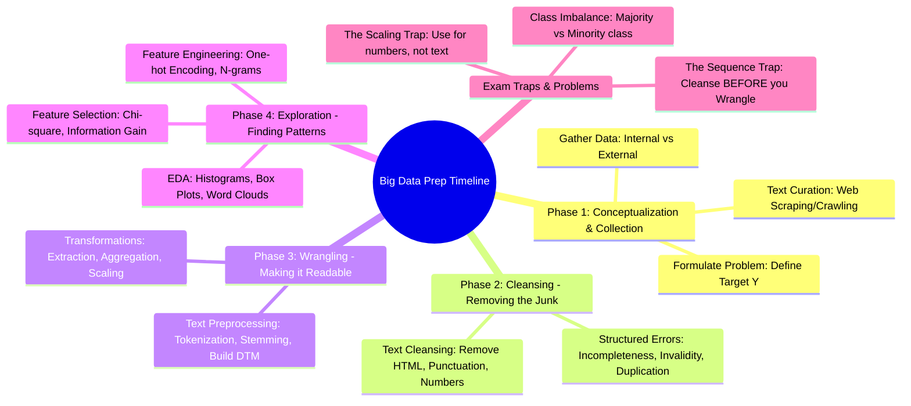

```mermaid
mindmap
  root((Big Data Prep Timeline))
    Phase 1: Conceptualization & Collection
      Formulate Problem: Define Target Y
      Gather Data: Internal vs External
      Text Curation: Web Scraping/Crawling
    Phase 2: Cleansing - Removing the Junk
      Structured Errors: Incompleteness, Invalidity, Duplication
      Text Cleansing: Remove HTML, Punctuation, Numbers
    Phase 3: Wrangling - Making it Readable
      Transformations: Extraction, Aggregation, Scaling
      Text Preprocessing: Tokenization, Stemming, Build DTM
    Phase 4: Exploration - Finding Patterns
      EDA: Histograms, Box Plots, Word Clouds
      Feature Selection: Chi-square, Information Gain
      Feature Engineering: One-hot Encoding, N-grams
    Exam Traps & Problems
      Class Imbalance: Majority vs Minority class
      The Scaling Trap: Use for numbers, not text
      The Sequence Trap: Cleanse BEFORE you Wrangle

```