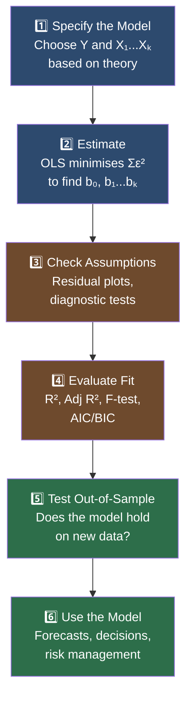

# Multiple Regression — Basics and Assumptions

## The Big Picture: Why One Variable Is Never Enough

Imagine you're trying to predict how fast a car will sell at auction. You could look at just the mileage — but that ignores the year, the brand, the condition, the colour, whether it's a diesel or petrol. Any single factor gives you a blurry, incomplete picture.

That's the problem [[Simple Linear Regression|simple regression]] solves halfway. **[[Multiple linear regression]] (MLR)** is the upgrade: it lets you pull in an entire *team* of variables simultaneously, isolating each one's true contribution while holding everything else constant.

In finance, almost nothing is driven by a single force. Stock returns respond to market movements, company size, valuations, momentum, and macroeconomic surprises — all at once. MLR is the tool that untangles them.

---

## LOS 1.a — What Problems Does MLR Solve?

### Three Categories of Investment Problems

```
┌─────────────────────────────────────────────────────────────────┐
│              WHAT MULTIPLE REGRESSION IS USED FOR               │
├─────────────────────────┬───────────────────────────────────────┤
│  1. IDENTIFY             │  Which factors actually explain Y?   │
│     RELATIONSHIPS        │  How strong is each relationship?    │
├─────────────────────────┼───────────────────────────────────────┤
│  2. FORECAST             │  Given X values, what will Y be?     │
│     VARIABLES            │  Cash flows, default probability...  │
├─────────────────────────┼───────────────────────────────────────┤
│  3. TEST                 │  Does Theory X hold in real data?    │
│     THEORIES             │  Is the Fama-French model complete?  │
└─────────────────────────┴───────────────────────────────────────┘
```

**Real-world examples:**

**1. Factor Attribution (Identifying Relationships)**
A portfolio manager uses the [[Fama-French Model]] to decompose a fund's returns. She regresses monthly fund returns on three factors: market excess return, [[SMB]] (small minus big), and [[HML]] (high minus low book-to-market). Each coefficient tells her how much of the fund's return is attributable to each factor — and the intercept (alpha) reveals whether the manager is adding value beyond these known premia.

**2. Predicting Default (Forecasting)**
A credit analyst builds a model to predict the probability that a corporate bond issuer will default over the next 12 months. Independent variables might include [[Debt-to-Equity|debt/equity ratio]], interest coverage, revenue growth, and industry sector. The model outputs a probability score for each issuer.

**3. Testing the Fama-French Model (Theory Testing)**
An academic wants to know whether adding an earnings momentum factor improves the five-factor Fama-French model's explanatory power. She adds the new variable and checks whether its coefficient is statistically significant and whether [[Adjusted R-squared|adjusted R²]] improves.

### The Regression Process — From Question to Answer



> [!tip] The Feedback Loop
> Step 3 (checking assumptions) often sends you back to Step 1. If residual plots reveal a non-linear relationship, you may need to add a squared term or transform a variable. Regression is iterative, not linear.

---

## LOS 1.b — Formulating the Model and Interpreting Coefficients

### The General MLR Equation

$$\boxed{Y_i = b_0 + b_1X_{1i} + b_2X_{2i} + \cdots + b_kX_{ki} + \varepsilon_i}$$

Every symbol deserves unpacking:

| Symbol | Name | Plain English |
|--------|------|---------------|
| $Y_i$ | Dependent variable | What you're trying to explain — the "target" |
| $b_0$ | Intercept | Expected value of $Y$ when **all** $X$'s = 0 |
| $b_k$ | Slope coefficient | How much $Y$ changes per 1-unit change in $X_k$, **holding all other variables constant** |
| $X_{ki}$ | Independent variable $k$ | One of the "drivers" or "features" |
| $\varepsilon_i$ | Error term (residual) | Everything the model doesn't capture — random noise |
| $i$ | Observation index | One data point (one company, one month, one property) |

The model is **estimated** by [[Ordinary Least Squares|OLS]]: the algorithm finds the values of $b_0, b_1, \ldots, b_k$ that minimise:

$$\sum_{i=1}^{n} \varepsilon_i^2 = \sum_{i=1}^{n} (Y_i - \hat{Y}_i)^2$$

The hat ($\hat{Y}_i$) means "predicted value." The residual ($\varepsilon_i$) is the gap between what the model predicted and what actually happened.

```
Actual Y
    │
    │    ● actual observation
    │   /│
    │  / │ ← ε (residual = actual minus predicted)
    │ /  │
    │/   ↓
    ●────── predicted Ŷ on regression surface
```

---

### The Partial Slope Coefficient — The Heart of MLR

This is the single most important interpretation concept. In simple regression:

$$\text{Simple: } \hat{Y} = 2.0 + 4.5X_1$$

The coefficient 4.5 means: "A 1-unit rise in $X_1$ is associated with a 4.5-unit rise in $Y$." But this includes **any and all** effects that travel through $X_1$ — including the indirect effect of any other variables correlated with $X_1$.

Now add $X_2$:

$$\text{Multiple: } \hat{Y} = 1.5 + 2.5X_1 + 3.8X_2$$

The coefficient on $X_1$ dropped from 4.5 to 2.5. Why? Because some of the apparent effect of $X_1$ was actually being "carried" by $X_2$. Now that $X_2$ is in the model, each coefficient represents the **pure, isolated** effect of that variable.

> [!info] Partial Slope Coefficients
> In MLR, each $b_k$ is called a **[[partial slope coefficient]]** (or **partial regression coefficient**) because it measures the effect of $X_k$ on $Y$ *holding all other independent variables constant*.
>
> This is the "ceteris paribus" of econometrics — everything else equal.

**Why this matters in finance:** Suppose you're regressing stock returns on both *size* and *book-to-market ratio*. Without controlling for both simultaneously, the estimated effect of size might be contaminated by the correlation between small stocks and value stocks. MLR isolates each factor's true contribution.

---

### Real-World Example: Arnott & Asness (2003) — Real Earnings Growth

Arnott and Asness tested whether future 10-year real S&P 500 earnings growth ($EG_{10}$) could be predicted by:
- $PR$ = trailing [[Dividend|dividend]] [[Payout ratio|payout ratio]] (%)
- $YCS$ = [[Yield curve]] slope (10-year Treasury minus 3-month T-bill, %)

$$\widehat{EG_{10}} = -11.6 + 0.25 \cdot PR + 0.14 \cdot YCS$$

**Interpreting each coefficient:**

| Coefficient | Value | Interpretation |
|-------------|-------|---------------|
| Intercept ($b_0$) | −11.6% | If PR = 0 and YCS = 0, expected 10yr earnings growth = −11.6% |
| $b_{PR}$ | +0.25 | A 1% rise in payout ratio → earnings growth rises 0.25%, **holding YCS fixed** |
| $b_{YCS}$ | +0.14 | A 1% steeper yield curve → earnings growth rises 0.14%, **holding PR fixed** |

> [!example] What "Holding Constant" Actually Means
> The PR coefficient (0.25) is not the effect of payout ratio in isolation. It's the effect *after removing the portion of PR that's explained by YCS*. Two companies with the same yield-curve environment but different payout ratios: the one with the higher payout ratio is predicted to have 0.25% higher earnings growth per 1% difference.

---

## LOS 1.c — The 5 Assumptions of MLR

For OLS to produce valid, reliable estimates, five conditions must hold. Think of them as the "rules of the road" — violating them doesn't crash the model, but it makes the outputs unreliable in specific ways.

```
┌──────────────────────────────────────────────────────────────┐
│                  5 MLR ASSUMPTIONS                            │
├────┬─────────────────────┬──────────────────────────────────┤
│ 1  │ Linearity           │ Y = straight-line combo of X's   │
│ 2  │ Normality           │ Residuals ~ Normal(0, σ²)        │
│ 3  │ Homoskedasticity    │ Var(ε) = σ² (constant)           │
│ 4  │ Independence        │ Cov(εᵢ, εⱼ) = 0 for i ≠ j       │
│ 5  │ No Multicollinearity│ X's not perfectly correlated      │
└────┴─────────────────────┴──────────────────────────────────┘
```

---

### Assumption 1 — Linearity

**What it means:** The relationship between $Y$ and each $X_k$ is linear (a straight line). More precisely, the *model is linear in the parameters* $b_k$, even if you've included transformations like $X^2$ or $\ln(X)$.

**What goes wrong if violated:** The model fits a straight line through a curved relationship — systematically overestimating in some ranges and underestimating in others. Coefficients are biased.

**Real-world cause:** Many financial relationships are non-linear. The relationship between a company's [[Leverage|leverage ratio]] and its probability of default is not a straight line — it accelerates dramatically at high leverage levels. A linear model would underestimate default risk for highly levered firms.

**Visual — residuals vs. fitted values:**
```
Healthy (linear):          Violated (non-linear):
    ε                          ε
    │  ·  · ·  ·               │     ·· ·
    │ · ·   ·  ·               │  ·         ·
────┼──────────────          ──┼──────────────
    │·  ·  ·  ·                │·               ·
    │   · · ·                  │   ·  ·· ·
         Ŷ                          Ŷ
    Random scatter              U-shaped curve → non-linearity
```

---

### Assumption 2 — Normality of Residuals

**What it means:** The error terms $\varepsilon_i$ are normally distributed with mean zero: $\varepsilon \sim N(0, \sigma^2)$.

**What goes wrong if violated:** [[t-Test|t-tests]] and [[F-test|F-tests]] for coefficient significance rely on the normality assumption. With fat-tailed or skewed residuals, significance tests are misleading — you may reject correct null hypotheses or fail to detect real effects.

**Real-world cause:** Financial data often has fat tails (asset returns during crises). Outliers from earnings surprises, defaults, or market crashes produce extreme residuals that deviate from normality.

> [!warning] Large Sample Rescue
> With large samples ($n > 100$), the [[Central Limit Theorem]] means coefficient estimates are approximately normally distributed *even if residuals aren't perfectly normal*. The normality assumption matters most for small samples.

---

### Assumption 3 — Homoskedasticity (Constant Variance)

**What it means:** The variance of the error term is the same across all observations: $\text{Var}(\varepsilon_i) = \sigma^2$ for all $i$.

**Violation: [[Heteroskedasticity]]** — error variance is not constant. It changes with the level of $X$ or $\hat{Y}$.

**What goes wrong:** Standard errors of the coefficients are incorrect → t-statistics are wrong → hypothesis tests are unreliable. Coefficients themselves are still unbiased, but you can't trust the significance test.

**Real-world cause:** Very common in cross-sectional financial data. When modelling stock returns across companies of very different sizes, large-cap companies tend to have larger absolute return swings than small caps — so the model's errors (residuals) grow with company size. Classic "fan shape" in the residual plot.

**Visual — residuals vs. fitted values:**
```
Homoskedastic (good):       Heteroskedastic (bad):
    ε                          ε
    │ · · ·  ·                 │                  · ·
    │· ·  · ·                  │           · ·   ·    ·
────┼──────────────          ──┼──────────────────────────
    │ · ·  ·                   │  · ·   ·  ·       ·   ·
    │·   · · ·                 │ ·  ·                ·    ·
         Ŷ                           Ŷ
    Consistent spread          Fan shape → variance grows with Ŷ
```

> [!danger] Exam Trap: Heteroskedasticity
> Heteroskedasticity does **not** bias coefficient estimates. It **does** invalidate standard errors and therefore all hypothesis tests. The fix is [[White-corrected SE|White (heteroskedasticity-robust) standard errors]].

---

### Assumption 4 — Independence of Errors (No Serial Correlation)

**What it means:** The error term for one observation is uncorrelated with the error term for any other observation: $\text{Cov}(\varepsilon_i, \varepsilon_j) = 0$ for $i \neq j$.

**Violation: [[Serial Correlation]] (Autocorrelation)** — residuals are correlated across time. Yesterday's error predicts today's error.

**What goes wrong:** Like heteroskedasticity: coefficients are unbiased but standard errors are wrong → t-stats are unreliable. With positive serial correlation (very common), standard errors are *understated* → t-statistics are *overstated* → you think your variables are more significant than they really are.

**Real-world cause:** Extremely common in time-series financial data. If your model systematically underestimates GDP growth in recessions (clusters of negative residuals), then knowing this month's residual tells you next month's will also be negative — the errors are not independent.

**Visual — residuals over time:**
```
No Serial Correlation:      Positive Serial Correlation:
    ε                          ε
    │·   ·  ·    ·             │ ·· ·
    │  ·    ·  ·               │       ·
────┼──────────────────      ──┼───────────────────────
    │   ·     · ·              │            · ·
    │ ·   ·      ·             │                 ·· ·
         Time                        Time
    Random flipping            Clusters → runs of same sign
```

> [!info] Detection & Fix
> - **Detect:** [[Durbin-Watson (Serial Correlation)|Durbin-Watson test]] (DW ≈ 2 = no SC; DW < 2 = positive SC)
> - **Fix:** [[Newey-West SE|Newey-West robust standard errors]] or add lagged variables to model

---

### Assumption 5 — No Perfect Multicollinearity

**What it means:** No independent variable is an exact linear combination of other independent variables. There is no perfect correlation between any two (or more) $X$'s.

**Violation: [[CFA_Glossary/Multicollinearity]]** — two or more $X$'s are highly (but not necessarily perfectly) correlated.

**What goes wrong:** The model can't separate the individual effects of correlated variables. Imagine trying to determine whether tall buildings are expensive because they have more floors ($X_1$) or because they have more square footage ($X_2$) — but floor count and square footage are 95% correlated. The individual coefficients become unstable, with huge standard errors, even though the model as a whole fits well.

**Symptoms:**
- High $R^2$ with insignificant individual t-statistics ("everything fits, nothing matters")
- Coefficient estimates flip sign or magnitude when you add/remove a variable
- [[VIF (Multicollinearity)|VIF > 5]] (investigate); VIF > 10 (serious problem)

**Real-world cause:** Factor models where included variables overlap. For example, including both *revenue growth* and *earnings growth* — these are highly correlated. Or including *book value* and *total assets* in a banking model.

> [!danger] Exam Trap: Multicollinearity
> Multicollinearity does **not** bias coefficients. The model's predictions and overall fit (R²) can still be fine. The problem is that individual coefficients can't be interpreted reliably — you can't tell which correlated variable is "really" driving the effect.

---

### The Assumptions At a Glance

| # | Assumption | Violation | Coefficients Biased? | Std Errors Wrong? | Fix |
|---|-----------|-----------|---------------------|------------------|-----|
| 1 | Linearity | Non-linearity | **YES** | Yes | Transform variables, add polynomial terms |
| 2 | Normality | Fat tails / skew | No (large n) | Minor | Robust methods, outlier handling |
| 3 | Homoskedasticity | [[Heteroskedasticity]] | No | **YES** | [[White-corrected SE\|White robust SE]] |
| 4 | Independence | [[Serial Correlation]] | No | **YES** | [[Newey-West SE\|Newey-West SE]], lag structure |
| 5 | No Multicollinearity | [[CFA_Glossary/Multicollinearity]] | No | **YES** | Remove/combine variables, PCA |

> [!tip] Memory Hook: "Only Non-linearity Breaks Coefficients"
> Assumptions 3, 4, and 5 make standard errors unreliable — not the coefficients themselves. Only violating the linearity assumption (Assumption 1) biases the coefficient estimates directly. This is a frequent exam distinction.

---

## Reading Residual Plots

Residual plots are your first diagnostic tool — a quick visual sanity check before running formal tests. Every well-specified model should pass all three.

### Plot 1 — Residuals vs. Fitted Values ($\hat{Y}$)

**What you're checking:** Linearity + Homoskedasticity

**The healthy plot:**
```
    ε  │
  +2   │    ·  ·    ·   ·    ·
  +1   │  ·   ·  ·    ·   ·
 ─────────────────────────────── 0
  -1   │   ·   ·   ·  ·    ·
  -2   │  ·  ·    ·    ·  ·
       └─────────────────────────
               Ŷ (predicted)
       ✓ Random cloud centred on 0
       ✓ Consistent spread (no fan)
       ✓ No curve or pattern
```

**Red flags:**
- **Fan shape** → [[Heteroskedasticity]] (variance grows with $\hat{Y}$)
- **U-shape or arch** → Non-linearity (missing a squared term)
- **Systematic drift** → Omitted variable bias

---

### Plot 2 — Residuals vs. Each Independent Variable ($X_k$)

**What you're checking:** Whether each variable's relationship with $Y$ has been correctly specified

**The healthy plot:**
```
    ε  │
  +2   │  ·      ·  ·      ·
  +1   │    ·  ·      ·  ·
 ──────────────────────────────── 0
  -1   │ ·   ·      ·    ·  ·
  -2   │   ·    ·  ·   ·
       └────────────────────────
                 X₁
       ✓ Scattered randomly around 0
       ✓ No pattern as X₁ changes
```

**Red flags:**
- **Upward/downward slope in residuals** → Variable is misspecified (wrong functional form)
- **Curved pattern** → Non-linear relationship with this X — consider $X_k^2$ or $\ln(X_k)$
- **Residuals growing with X** → Heteroskedasticity driven by this specific variable

---

### Plot 3 — Normal Q-Q Plot of Residuals

**What you're checking:** Normality of the error distribution

**How to read it:** Plot the quantiles of your residuals against the quantiles of a perfect normal distribution. If residuals are normal, they fall along a straight 45° diagonal.

```
Theoretical        Healthy (normal):        Violated (fat tails):
Normal
Quantiles
   +3 │                   /           │             ·  ·
   +2 │               ·/·             │          ·/
   +1 │           ·/·                 │       ·/
    0 │       ·/·                     │    ·/·
   -1 │   ·/·                         │ ·/
   -2 │ ·/·                           │/·
   -3 │·/                             │ ·  ·
      └────────────────────           └────────────────────
           Sample Quantiles                Sample Quantiles
      Dots hug the diagonal           Ends curve away → fat tails
```

**Red flags:**
- **S-curve (both tails bend away)** → Fat tails / leptokurtosis (common in financial data)
- **Concave/convex curve** → Skewness in residuals
- **Single extreme outlier** → Potential influential observation to investigate

---

### The Office Rent Model — Putting It All Together

An analyst models office rents in a US city with 191 observations:

$$\widehat{Rent}_i = b_0 + b_1(\text{Age}_i) + b_2(\text{Distance from CBD}_i) + b_3(\text{Floor Area}_i) + \varepsilon_i$$

**Interpreting the three residual plots:**

> [!example] Plot 1: Residuals vs. Fitted Values
> The residuals scatter randomly around the horizontal line at 0, with no discernible pattern or funnel shape. This is [[Consistent|consistent]] with:
> - ✅ **Linearity** — no arch or U-shape
> - ✅ **[[Homoskedasticity|Homoskedasticity]]** — spread appears constant across predicted rent levels

> [!example] Plot 2: Residuals vs. [[Independent|Independent]] Variables
> The residuals show no directional trend against any of the three [[Independent|independent]] variables (age, distance, floor area). This confirms:
> - ✅ Each variable appears correctly specified
> - ✅ No omitted non-linear terms are obvious

> [!example] Plot 3: Normal Q-Q Plot
> The middle of the distribution hugs the diagonal, but both tails deviate outward. A few observations extend beyond −3 standard deviations; the right tail shows some positive skew (dots above the line).
>
> ⚠️ **Conclusion:** Residuals are approximately normal in the middle but have **fat tails** and slight **right skewness**. Formally test with a test like [[Jarque-Bera test|Jarque-Bera]]. With n=191, moderate non-normality is less catastrophic than with small samples.

---

## Exam Traps Summary

> [!danger] Top 5 Traps for LOS 1.a–1.c
>
> **1. Partial slope ≠ simple slope**
> Adding variables to a regression changes existing coefficients. A coefficient that was 4.5 in simple regression may be 2.5 in MLR — neither is "wrong," they answer different questions.
>
> **2. Only non-linearity biases coefficients**
> [[Heteroskedasticity|Heteroskedasticity]], [[Serial Correlation|serial correlation]]on|correlation]], and [[Multicollinearity|multicollinearity]] make standard errors wrong, but the coefficient estimates themselves are still valid (unbiased). Non-linearity biases both.
>
> **3. [[Multicollinearity|Multicollinearity]] doesn't affect the whole model — just individual coefficients**
> High R² + insignificant t-stats is a classic [[Multicollinearity|multicollinearity]] symptom. The model predicts well as a whole, but individual coefficients can't be trusted.
>
> **4. [[Positive serial correlation|Positive serial correlation]] overstates significance**
> With positive SC, standard errors are understated → t-statistics are inflated → you think variables are significant when they might not be.
>
> **5. The intercept is only meaningful when X = 0 is plausible**
> In the Arnott-Asness model, −11.6% earnings growth when PR and YCS both = 0 is an extrapolation outside the data range. Don't over-interpret intercepts.

---

## Related Concepts

- [[Simple Linear Regression]] — the one-variable foundation
- [[Ordinary Least Squares]] — the [[Estimation|estimation]] method (minimises Σε²)
- [[Partial Slope Coefficient]] — the key interpretation concept in MLR
- [[Heteroskedasticity]] — Assumption 3 violation; fix with White robust SE
- [[Serial Correlation]] — Assumption 4 violation; detect with Durbin-Watson
- [[CFA_Glossary/Multicollinearity]] — Assumption 5 violation; detect with VIF
- [[Residual]] — the [[Error term|error term]]; central to all diagnostic plots
- [[R-squared]] / [[Adjusted R-squared]] — measures of model fit (LOS 1.d)
- [[F-test]] — joint test of all coefficients (LOS 1.d/1.e)
- [[Fama-French Model]] — a real-world MLR application
- [[VIF (Multicollinearity)|VIF]] — Variance [[Inflation|Inflation]] Factor for detecting [[Multicollinearity|multicollinearity]]
- [[Durbin-Watson (Serial Correlation)|Durbin-Watson Test]] — [[Serial Correlation|serial correlation]]on|correlation]] diagnostic
- [[White-corrected SE|White Robust Standard Errors]] — [[Heteroskedasticity|heteroskedasticity]] fix
- [[Newey-West SE|Newey-West Standard Errors]] — [[Serial Correlation|serial correlation]]on|correlation]] fix
