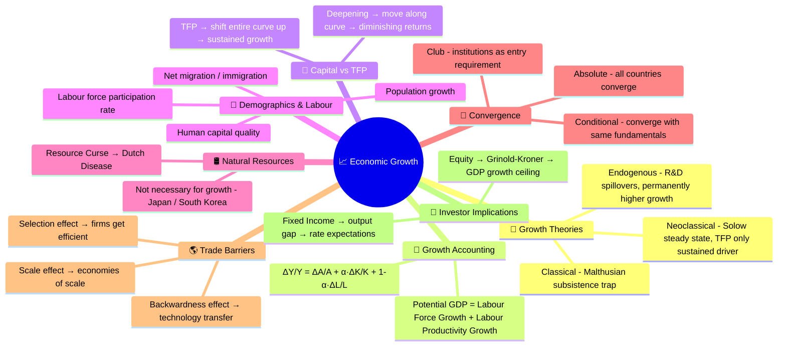
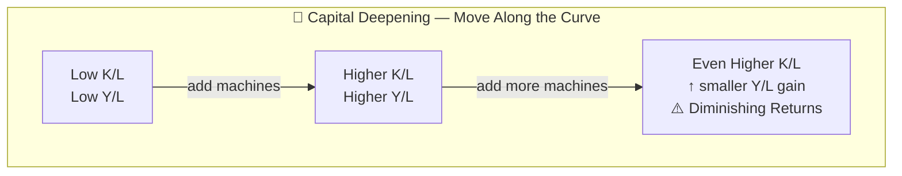
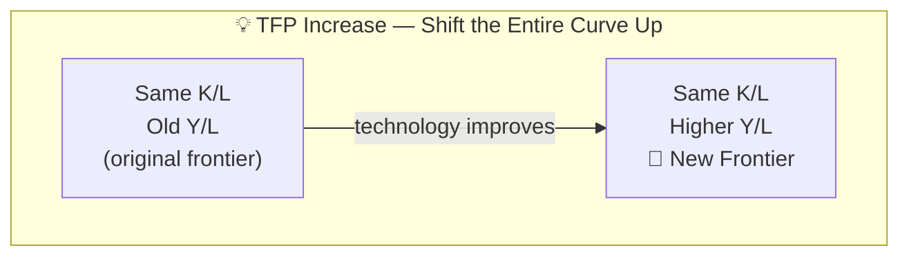
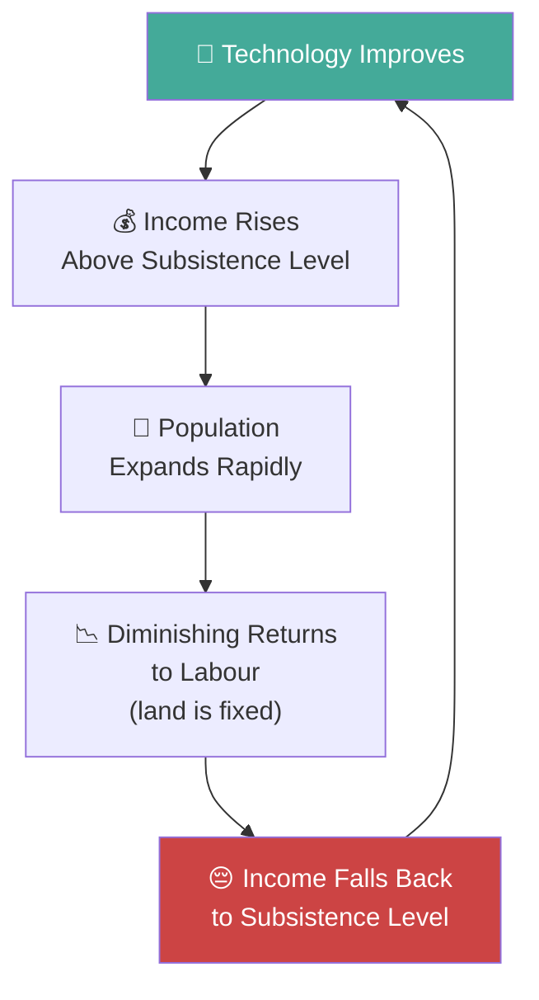
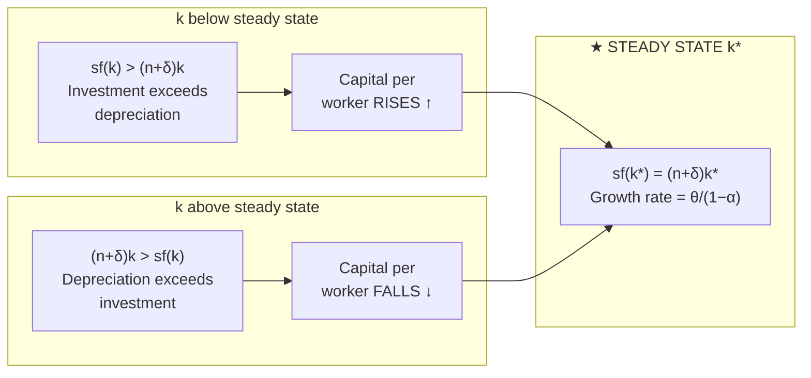
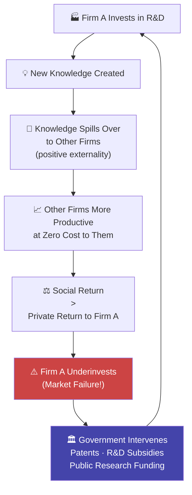
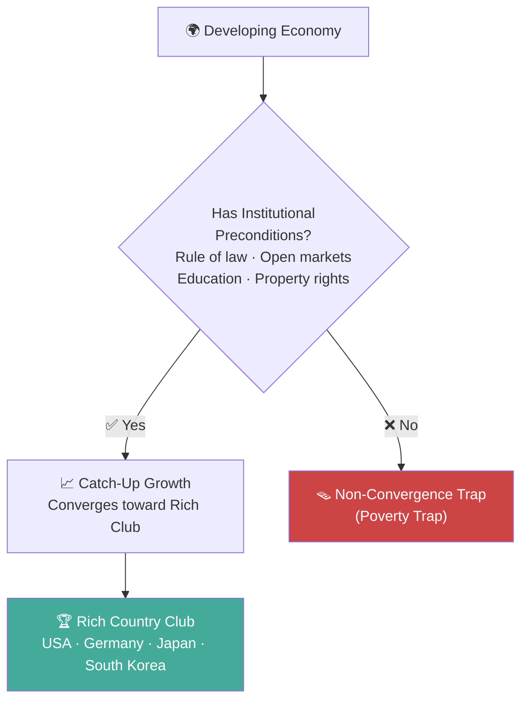
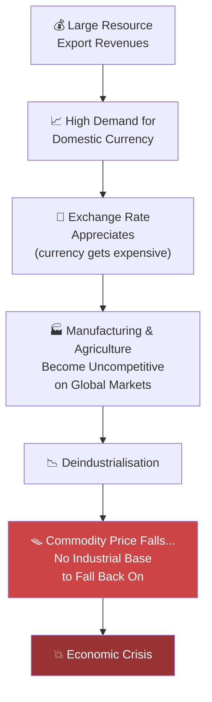
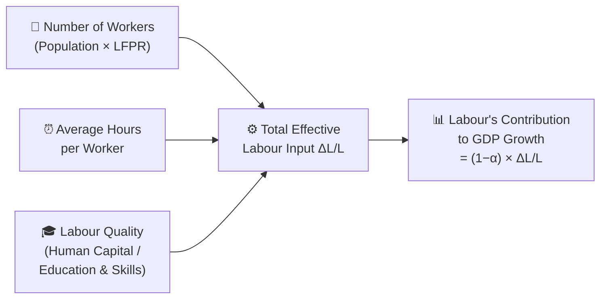

# Economic Growth

## The Big Picture: Why Nations Get Rich (or Don't)

Imagine two neighbouring coffee shops. The first hires more baristas (labour) and buys more espresso machines (capital) — it can serve more customers, but only up to a point. Eventually the café gets crowded and each additional machine adds less and less [[Productivity|productivity]]. The second shop invents a frothy new technique that lets every barista serve twice as many cups per hour. That second source of growth — working *smarter* — is what separates wealthy nations from poor ones over the long run.

That intuition maps directly onto CFA macroeconomic growth theory: countries can grow by accumulating more inputs (**[[Capital Deepening|capital deepening]]**) or by using existing inputs more efficiently (**[[Total factor productivity|Total Factor Productivity]] / TFP**). Classical, neoclassical, and endogenous growth models each tell a different story about which source dominates and how long it lasts.

---

## Mindmap: Economic Growth at a Glance

---

## The Foundation: The Cobb-Douglas Production Function

All modern growth theory starts with one equation — the **Cobb-Douglas production function** (named after Charles Cobb and Paul Douglas, who estimated it from US manufacturing data). Think of it as the economy's "recipe":

$$Y = A \cdot K^{\alpha} \cdot L^{1-\alpha}$$

| Symbol | Meaning | Typical value |
|--------|---------|--------------|
| $Y$ | Aggregate real output (GDP) | — |
| $A$ | **Total Factor Productivity (TFP)** — technology & efficiency | The residual after K and L are accounted for |
| $K$ | Stock of physical capital (machines, buildings, infrastructure) | — |
| $L$ | Labour input (workers × hours) | — |
| $\alpha$ | Capital's share of national income | ~0.30–0.35 in most economies |
| $1-\alpha$ | Labour's share of national income | ~0.65–0.70 |

> [!tip] Mnemonic: "A King Lives"
> **A** (TFP) × **K**apital^α × **L**abour^(1−α) = **Y**ield (GDP)
> Remember: A is always first — technology is the crown jewel.

**Key property — diminishing marginal productivity:** If you hold $L$ fixed and keep increasing $K$, each additional unit of capital adds *less* to output. This is why simply buying more machines can't sustain growth forever.

---

## Capital Deepening vs. Technological Progress (TFP)

This contrast is one of the most tested concepts in the CFA curriculum. Both raise output, but in fundamentally different ways.

### Capital Deepening

**Capital deepening** (*= capital intensity*) means increasing the ratio of capital to labour — giving each worker more tools. On a production function diagram, deepening is a **movement along** the existing curve.

Because of diminishing returns, the marginal product of capital falls as K/L rises. This means capital deepening *cannot* sustain long-run growth in per capita output — it runs into a wall.

### Technological Progress (TFP)

TFP represents any improvement that lets the same inputs produce *more* output — better management, new processes, scientific discoveries, organisational innovation. On the diagram, TFP **shifts the entire curve upward**:

> [!important] The Key Insight
> Sustained long-run growth in **per capita** income requires continuous improvement in TFP. Capital deepening alone eventually stalls because of diminishing returns.

| Feature | Capital Deepening | TFP (Technology) |
|---------|------------------|-----------------|
| Mechanism | More K per worker | Better use of K and L |
| Graph effect | Movement *along* curve | Shift *of* curve |
| Subject to diminishing returns? | **Yes** | **No** |
| Long-run growth driver? | Temporary | Sustained |
| Main driver in developing countries? | ✅ Yes | Less so |
| Main driver in developed countries? | Less so | ✅ Yes |

---

## The Growth Accounting Equation

**Growth accounting** decomposes observed GDP growth into contributions from each factor. Take the Cobb-Douglas function and convert it into growth rates:

### Derivation

$$Y = A \cdot K^{\alpha} \cdot L^{1-\alpha}$$

Taking the growth-rate form (logarithmic differentiation):

$$\frac{\Delta Y}{Y} = \frac{\Delta A}{A} + \alpha \cdot \frac{\Delta K}{K} + (1-\alpha) \cdot \frac{\Delta L}{L}$$

| Term | Interpretation |
|------|---------------|
| $\frac{\Delta Y}{Y}$ | Real GDP growth rate |
| $\frac{\Delta A}{A}$ | TFP growth (the "Solow residual" — what's left after K and L) |
| $\alpha \cdot \frac{\Delta K}{K}$ | Contribution of capital growth (weighted by capital's income share) |
| $(1-\alpha) \cdot \frac{\Delta L}{L}$ | Contribution of labour growth (weighted by labour's income share) |

Per-worker form (subtract $\Delta L/L$ from both sides):

$$\frac{\Delta(Y/L)}{Y/L} = \frac{\Delta A}{A} + \alpha \cdot \frac{\Delta(K/L)}{K/L}$$

This tells us: **labour productivity growth = TFP growth + (capital's share × capital deepening rate).**

### Worked Numerical Example

> Suppose an economy has:
> - Capital growth ($\Delta K/K$) = 4%  
> - Labour growth ($\Delta L/L$) = 2%  
> - TFP growth ($\Delta A/A$) = 1%  
> - Capital share ($\alpha$) = 0.30

$$\frac{\Delta Y}{Y} = 1\% + (0.30 \times 4\%) + (0.70 \times 2\%)$$
$$= 1\% + 1.2\% + 1.4\% = \mathbf{3.6\%}$$

Labour productivity growth:
$$= 1\% + 0.30 \times (4\% - 2\%) = 1\% + 0.6\% = \mathbf{1.6\%}$$

---

## Forecasting Potential GDP

**Potential GDP** (also called *trend GDP* or *productive capacity*) is the maximum output an economy can sustain without generating inflationary pressure — the economy's "speed limit." It is distinct from *actual* GDP, which fluctuates with the business cycle.

### Two Approaches

**Method 1 — Growth Accounting (plug trend values into the equation):**

$$\text{Potential GDP growth} = \text{Trend TFP growth} + \alpha \cdot \text{Trend capital growth} + (1-\alpha) \cdot \text{Trend labour growth}$$

**Method 2 — Labour Productivity Shortcut (more commonly tested):**

$$\boxed{\text{Potential GDP growth} = \text{Growth in labour force} + \text{Growth in labour productivity}}$$

This is intuitive: the economy can produce more either because there are more workers *or* because existing workers are more productive.

### Worked Example

> Economy data:
> - Labour force growing at 1.5% per year
> - Labour productivity growing at 1.8% per year

$$\text{Potential GDP growth} = 1.5\% + 1.8\% = \mathbf{3.3\%}$$

> [!note] Output Gap
> **Output gap** = Actual GDP − Potential GDP  
> *Positive gap* (overheating) → inflationary pressure → central bank raises rates  
> *Negative gap* (recession) → deflationary pressure → central bank cuts rates  
> Bond investors watch the output gap closely because it signals future rate policy.

---

## Three Theories of Economic Growth

> [!tip] Mnemonic: "Can Nonsense Ever Stop?"
> **C**lassical → **N**eoclassical → **E**ndogenous — each one fixes a flaw in the previous.

### 1. Classical (Malthusian) Growth Theory

Developed by Thomas Malthus in the late 18th century. The central idea is bleak: *population growth will always consume any gains in living standards.*

**The Malthusian Trap:**

**Key implication:** Technological progress leads to a *larger* population, not a *richer* one. This was consistent with most of human history before the Industrial Revolution, when income per capita was remarkably flat for millennia.

**Why it failed:** The theory missed the fact that technological progress could eventually outpace population growth, and that rising incomes tend to *reduce* birth rates (the demographic transition).

---

### 2. Neoclassical Growth Theory (Solow Model)

The **Solow model** (Robert Solow, 1956) is the backbone of mainstream macroeconomic growth theory. Its central contribution is the concept of the **steady state**.

#### The Steady State

The **steady state** (also called the *balanced growth path*) is the long-run equilibrium where:
- Output per worker ($Y/L$) is constant
- Capital per worker ($K/L$) is constant
- Both grow at the rate of TFP growth, $\theta/(1-\alpha)$

#### Sustainable Growth Rate Formula

In the Solow steady state:

$$\text{Sustainable per-capita growth rate} = \frac{\theta}{1-\alpha}$$

Where:
- $\theta$ = TFP growth rate
- $\alpha$ = capital's income share

So if $\theta = 1\%$ and $\alpha = 0.30$:

$$g^* = \frac{1\%}{1-0.30} = \frac{1\%}{0.70} \approx \mathbf{1.43\%}$$

#### The Role of Savings in the Solow Model

A higher savings rate is like pouring water into a bucket with a hole (depreciation). A bigger savings rate pushes the economy to a higher level of capital and output per worker, but once it reaches the new steady state, the *growth rate* returns to $\theta/(1-\alpha)$.

> [!warning] Key Solow Insight
> In the Solow model, the savings rate affects the **level** of GDP per capita (permanently richer), but not the long-run **growth rate**. Only TFP growth determines the sustainable growth rate.

| If savings rate ↑ | Short run | Long run |
|------------------|-----------|---------|
| Growth rate | Temporarily higher | Returns to $\theta/(1-\alpha)$ |
| Level of Y/L | Rises | Stays at new, higher level |

#### Solow Model: Key Predictions

1. **Convergence:** Countries with less capital will grow faster (diminishing returns → high marginal product of capital in poor countries). → Capital flows from rich to poor.
2. **Exogenous technology:** TFP growth falls from the sky — it is not explained by the model.
3. **Policy levers are limited:** Government policy can only affect the level, not the long-run rate, of growth.

---

### 3. Endogenous Growth Theory

Endogenous growth models (Romer, Lucas — 1980s/90s) were created to fix the Solow model's biggest flaw: treating TFP as exogenous (unexplained). The key innovation: **knowledge capital does not exhibit diminishing returns.**

#### The AK Model

The simplest endogenous growth model replaces diminishing returns with a linear relationship:

$$Y = A \cdot K$$

Here, $K$ includes *both* physical and human/knowledge capital. Because knowledge has **spillovers** (externalities), one firm's innovation raises the productivity of all firms — so the economy-wide return to "capital" never falls.

#### Spillovers and Market Failure

> [!important] Key Endogenous Growth Insight
> Unlike Solow, a higher savings/investment rate **permanently** raises the growth rate (not just the level). This is because knowledge capital has no diminishing returns.

| Feature | Classical | Neoclassical (Solow) | Endogenous |
|---------|-----------|---------------------|-----------|
| Main driver of sustained growth | Nothing (subsistence trap) | Exogenous TFP | R&D, human capital (endogenous) |
| Diminishing returns to capital? | Yes | Yes | **No** (knowledge spillovers) |
| Savings rate effect on long-run growth? | None | Level only | **Permanent ↑ growth rate** |
| Policy effectiveness | None | Limited | **High** (R&D subsidies, education) |
| Convergence predicted? | No | **Yes** | **No** (rich stay rich or get richer) |
| Technology | Fixed (land is the limit) | Exogenous | Endogenous (explained within model) |

> [!tip] Mnemonic for Theory Differences
> **C**lassical = **C**eiling (subsistence trap ceiling on growth)  
> **N**eoclassical = **N**eutral on savings (level, not rate)  
> **E**ndogenous = **E**verything inside (R&D, spillovers, permanent effects)

---

## Convergence Hypotheses

Convergence asks: *will poor countries catch up to rich ones?* The neoclassical model says yes; endogenous growth says no.

### Absolute (Unconditional) Convergence

All developing economies will eventually converge to the income level of developed economies, regardless of starting conditions. This is the strongest — and most easily rejected — form.

**Empirical reality:** In practice, some countries (Sub-Saharan Africa) have failed to converge at all. Absolute convergence doesn't hold globally.

### Conditional Convergence

Countries converge to their *own* steady-state income level — which depends on their fundamentals:
- Savings rate
- Population growth rate
- Technology access
- Institutional quality (rule of law, property rights)

Countries with *similar* fundamentals converge; those with different fundamentals converge to *different* levels.

### Club Convergence (Convergence Clubs)

Only countries that meet certain preconditions join the "rich country club" and converge. Countries without these conditions can fall into a **non-convergence trap** (poverty trap).

**Preconditions for convergence:**
1. Stable political institutions and rule of law
2. Property rights and enforceable contracts
3. Open financial markets (savers can fund firms)
4. Free trade and foreign investment
5. Education and health systems (human capital)

> [!tip] Exam shortcut
> **Absolute convergence** → Neoclassical prediction; the *weakest* empirical support  
> **Conditional convergence** → Most empirically supported  
> **Club convergence** → Adds institutional preconditions to conditional convergence

---

## Why Potential GDP Matters to Investors

### For Equity (Stock) Investors

In the long run, aggregate corporate profits *cannot* grow faster than the economy as a whole. If they did, corporate profits would eventually represent more than 100% of GDP — a mathematical impossibility.

**The Grinold-Kroner Model** decomposes expected equity returns:

$$E(R_e) = \underbrace{dy}_{\text{dividend yield}} + \underbrace{\Delta(P/E)}_{\text{repricing}} + \underbrace{i}_{\text{inflation}} + \underbrace{g}_{\text{real GDP growth}} - \underbrace{\Delta S}_{\text{dilution from new shares}}$$

| Component | Meaning |
|-----------|---------|
| $dy$ | Dividend yield (cash return to shareholders) |
| $\Delta(P/E)$ | Change in valuation multiple (sentiment / repricing) |
| $i$ | Inflation (nominal earnings growth) |
| $g$ | Real GDP growth rate — the **sustainable** ceiling on real profit growth |
| $\Delta S$ | Share dilution (new equity issuance reduces per-share value) |

**Key link:** The higher the sustainable GDP growth rate, the higher the long-run expected equity return ceiling.

### For Fixed Income (Bond) Investors

Three channels:

| Channel | Mechanism |
|---------|-----------|
| **Output gap** | Negative gap → central bank cuts rates → bond prices rise |
| **Real interest rates** | High-growth economies attract investment → higher real rates → bonds cheaper |
| **Credit quality** | High potential growth → stronger fiscal position → better sovereign credit rating |

> [!example] Practical Application
> If potential GDP growth slows from 3% to 1.5% (e.g., demographic decline), equity return expectations should be revised down. For bonds, slower growth implies lower neutral real rates → generally bond-friendly.

---

## Factors Favouring and Limiting Growth

### In Developed Economies

| Favours Growth | Limits Growth |
|---------------|--------------|
| High TFP from R&D investment | Diminishing returns to capital (high capital stock) |
| Strong institutions (property rights, rule of law) | Aging demographics → shrinking labour force |
| Deep financial markets | High public debt → crowding out |
| Education quality | Slower population growth |
| Trade openness | Structural rigidities (labour market regulation) |

### In Developing Economies

| Favours Growth | Limits Growth |
|---------------|--------------|
| Low capital per worker → high marginal return | Weak institutions, corruption |
| Technology catch-up (copy from advanced nations) | Poor financial markets (savings can't reach firms) |
| Demographic dividend (young, growing population) | Political instability |
| Trade and FDI inflows | Low human capital (poor education/health) |
| Low starting income → wide gap to close | Resource curse / Dutch Disease |

> [!tip] Mnemonic: "FINITE" — preconditions for growth
> **F**inancial markets  
> **I**nstitutions (rule of law, property rights)  
> **N**atural openness to trade  
> **I**nvestment in human capital  
> **T**echnology access  
> **E**ducation and health

---

## Investment in Physical Capital, Human Capital, and Technology

### Physical Capital

Physical capital investment raises the capital-to-labour ratio (capital deepening). Effects:
- Raises labour productivity in the short-to-medium run
- Subject to diminishing returns (each machine adds less)
- ICT (information and communications technology) capital deepening has been a dominant source of growth since the 1980s

### Human Capital

**Human capital** is the accumulated stock of skills, knowledge, and health in the workforce — the result of education, training, and on-the-job learning.

**Why human capital is special:**
- Exhibits *positive externalities* (a more educated worker raises colleagues' productivity)
- Embodies in workers (can't be easily copied unlike physical machines)
- Improves adaptability — educated workers adopt new technology faster

**Policy implication:** Investment in education generates social returns that exceed private returns → justifies government subsidies for schooling.

### Technology (R&D and Knowledge)

Technology investment produces knowledge — a **public good** with key characteristics:

| Characteristic | Meaning |
|---------------|---------|
| **Non-rival** | One firm using an idea doesn't prevent another from using it |
| **Partially non-excludable** | Hard to stop knowledge from spreading (patents help, but aren't perfect) |

Because of these properties, **private R&D underinvestment** is a market failure:
- Social return > Private return (spillovers benefit non-investing firms)
- Without intervention, the economy gets too little innovation

**Government remedies:**
1. **Patents** — temporary monopoly rights to reward inventors
2. **R&D tax credits and subsidies** — lower the cost of innovation
3. **Public universities and basic research funding** — government directly produces foundational knowledge
4. **Endogenous growth implication:** These policies can permanently raise the long-run growth rate (unlike in the Solow model where policy only shifts the level).

---

## Natural Resources and Economic Growth

### The Conventional View (Wrong)

Intuition says: countries with abundant natural resources (oil, minerals, land) should grow faster. History suggests otherwise.

### Japan and South Korea: Resource-Poor, Extremely Wealthy

Both nations have almost no natural resources yet achieved dramatic post-war growth. **Reason:** Resources can be *traded for* — what matters is manufacturing efficiency, human capital, and technology. Resource ownership is not a prerequisite for growth.

### The Resource Curse

Empirically, some resource-rich nations (Venezuela, Nigeria, Equatorial Guinea) grow *more slowly* than resource-poor peers. Why?

**Dutch Disease** (named after the Netherlands' 1960s experience with North Sea gas):

**Additional resource curse mechanisms:**
- Corruption and rent-seeking (fighting over resource income rather than producing)
- Political instability (resource revenues fund conflict)
- Neglect of institution-building (governments fund themselves through resources, not taxes → less accountability)

> [!warning] Exam Trap
> The CFA curriculum is careful to say resource abundance **can** constrain growth but does **not always**. Norway is resource-rich *and* wealthy — the difference is institutional quality (the Government Pension Fund, transparent governance).

**Conclusion:** Natural resources are neither necessary nor sufficient for economic growth. Institutions, human capital, and technology matter far more.

---

## Demographics, Immigration, and Labour Force Participation

Labour input in the growth accounting equation ($\Delta L/L$) is driven by four factors:

### 1. Population Growth

- Larger population → larger *total* GDP
- But not necessarily higher *per capita* GDP
- Rapid population growth in least-developed countries can dilute capital per worker (negative for productivity)

### 2. Labour Force Participation Rate (LFPR)

**LFPR** = (number actively working or seeking work) ÷ (working-age population)

Key trends:
- Female labour force participation has been a major source of growth in many OECD countries
- Aging populations reduce LFPR as retirees exit the workforce
- **Demographic dividend:** A bulge in the working-age population (common in developing nations as birth rates fall faster than the population ages) can boost growth for a generation

### 3. Net Migration (Immigration)

- Immigration raises labour supply, especially in countries with low birth rates
- Immigrants often fill skills gaps (high-skilled immigration → TFP boost; low-skilled immigration → labour force expansion)
- Key for developed economies facing demographic headwinds (Japan, Germany, Italy)

### 4. Average Hours Worked

- Workers in many rich countries have chosen more leisure over longer hours
- Declining average hours work against growth even if employment is high
- Labour quality (skills) matters as much as quantity (hours)

> [!example] Demographic Example
> A country's working-age [[Population|population]] grows at 0.5%/yr, but LFPR falls from 68% to 65% over 10 years, and average hours worked fall 1% per year. The *effective* labour input growth could be negative — dragging [[Potential GDP|potential GDP]] below [[Population|population]] growth.

---

## Impact of Removing Trade Barriers

When a country reduces tariffs, quotas, or investment restrictions, three major effects follow:

### 1. The Selection Effect

Trade forces domestic firms to compete with global producers. Less efficient firms exit; the surviving firms are the most productive. This raises aggregate TFP.

### 2. The Scale Effect

Companies that survive trade liberalisation can now sell to a global market, achieving **[[Economies of scale|economies of scale]]** (lower average costs from higher volume). Lower costs → higher profits and lower prices for consumers.

### 3. The Backwardness Effect (Technology Transfer)

Developing economies can access and adopt technologies from advanced nations through:
- [[Foreign direct investment|Foreign direct investment]] (FDI) brings advanced machinery and management practices
- Trade exposes local firms to global best practices
- Endogenous growth models predict this [[Technology|technology]] transfer can produce *permanent* increases in growth rates

### Summary Table: Trade Liberalisation Effects

| Dimension | Developed Country | Developing Country |
|-----------|------------------|-------------------|
| **Capital investment** | Capital flows OUT to higher-return developing markets | Capital flows IN from abroad |
| **Profits** | Pressure from low-cost competition; but gains from scale | Higher profits as access to global markets opens |
| **Employment** | Some job losses in uncompetitive sectors | Job gains in export industries |
| **Wages** | Downward pressure in uncompetitive sectors; up in competitive ones | Real wages rise as capital deepens |
| **Growth rate** | Temporary boost (Solow) or permanent (endogenous) | Accelerated catch-up growth |

> [!note] The Trade-Growth Link
> The neoclassical view says trade liberalisation only provides a *temporary* boost to the growth rate (shifts the level, like a savings increase). [[Endogenous growth theory|Endogenous growth theory]] argues it can provide a *permanent* increase through [[Technology|technology]] transfer and knowledge spillovers.

---

## Stock Market Appreciation and Sustainable GDP Growth

This LOS is frequently tested through the **Grinold-Kroner** framework.

**The fundamental constraint:** In the long run, the growth rate of corporate [[Earnings per share|earnings per share]] cannot persistently exceed the economy's [[Sustainable growth rate|sustainable growth rate]]. If earnings grow faster, the corporate sector's share of GDP would eventually exceed 100% — impossible.

**Therefore:**

$$\text{Long-run real equity return ceiling} \approx \text{Potential GDP growth rate} + \text{Dividend yield}$$

More precisely, using Grinold-Kroner:

$$E(R_e) = dy + \Delta(P/E) + i + g - \Delta S$$

For **long-run** analysis, investors typically assume:
- $\Delta(P/E) \approx 0$ (valuations mean-revert)
- $\Delta S \approx 0$ (share count is stable in aggregate, or is a known drag)

Leaving: $E(R_e) \approx dy + i + g$

### Worked Example

> Country X: [[Dividend yield|Dividend yield]] = 2%, [[Inflation|inflation]] = 2%, potential [[Real GDP|real GDP]] growth = 3%
> Expected nominal equity return ≈ 2% + 2% + 3% = **7%**
>
> If [[Potential GDP|potential GDP]] growth falls to 1.5% (demographic slowdown):
> Expected return falls to 2% + 2% + 1.5% = **5.5%**

This is why macro-aware equity analysts pay close attention to central bank and IMF estimates of [[Potential GDP|potential GDP]] growth.

---

## Quick-Reference: All LOS Covered

| LOS | Where Covered |
|-----|--------------|
| Compare factors favouring/limiting growth in developed vs. developing | "Factors Favouring and Limiting Growth" section |
| Stock market appreciation ↔ [[Sustainable growth rate|sustainable growth rate]] | "Stock Market Appreciation" section + Grinold-Kroner |
| [[Potential GDP|Potential GDP]] matters for equity and fixed income investors | "Why Potential GDP Matters to Investors" section |
| [[Capital Deepening|Capital deepening]] vs. technological progress | "[[Capital Deepening|Capital Deepening]] vs. Technological Progress" section |
| Forecasting potential GDP via [[Growth Accounting|growth accounting]] | "[[Growth Accounting|Growth Accounting]]" + "Forecasting Potential GDP" sections |
| Natural resources and growth | "Natural Resources" section |
| Demographics, immigration, LFPR | "Demographics" section |
| Physical capital, [[Human capital|human capital]], [[Technology|technology]] investment | "Investment in Physical Capital..." section |
| Classical vs. neoclassical vs. [[Endogenous growth theory|endogenous growth theory]] | "Three Theories" section + comparison table |
| [[Convergence|Convergence]]ce Hypotheses|[[Convergence|Convergence]] hypotheses]] | "[[Convergence Hypotheses|Convergence Hypotheses]]" section |
| Government incentives for R&D/knowledge | "Why Governments Provide Incentives" in [[Technology|Technology]] subsection |
| Trade barriers removal | "Impact of Removing Trade Barriers" section |

---

## Memory Hooks and Exam Mnemonics

| Concept | Mnemonic |
|---------|---------|
| Growth theories | **C**an **N**onsense **E**ver Stop? (Classical → Neoclassical → Endogenous) |
| Preconditions for growth | **FINITE** (Financial markets, Institutions, Natural openness, Investment in [[Human capital|human capital]], Technology, Education) |
| Solow vs. Endogenous on savings | Solow: savings changes the **Level**; Endogenous: savings changes the **Rate** |
| [[Dutch disease|Dutch Disease]] | "Too much oil **drowns** your factories" |
| Cobb-Douglas | "A **K**ing **L**ives" (A × K^α × L^(1-α) = Y) |
| [[Convergence|Convergence]] clubs | "Only members with the **right club card** (institutions) get in" |
| [[Capital Deepening|Capital deepening]] | "Move **along** the curve" |
| TFP / technology | "**Shift** the whole curve" |

---

## Related Notes

- [[Currency Exchange Rates Understanding Equilibrium Value]] — exchange rates affected by growth differentials
- [[Economics and Investment Markets]] — how growth phases affect asset prices
- [[Carry Trades]] — growth and [[Interest rate|interest rate]] differentials
- [[Analysis of Active Portfolio Management]] — equity return model (Grinold-Kroner)
- [[Measuring and Managing Market Risk]] — potential GDP in macro stress scenarios
- [[Equity Valuation Applications and Processes]] — sustainable growth as a [[Valuation|valuation]] input
- [[Discounted Dividend Valuation]] — Gordon growth model uses [[Sustainable growth rate|sustainable growth rate]] $g$
- [[Free Cash Flow Valuation]] — FCFF forecasts anchored to macro growth outlook
