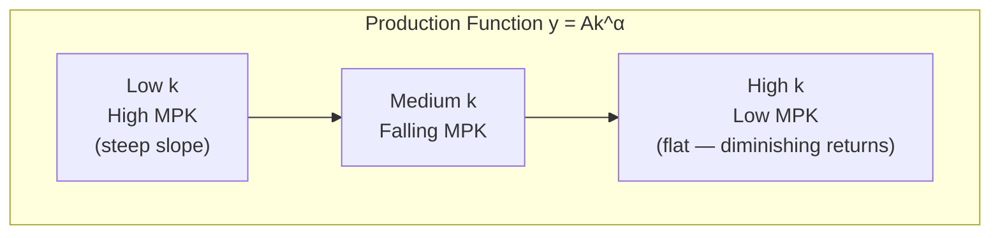
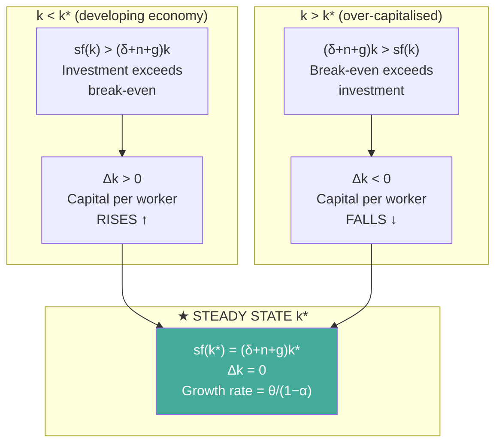
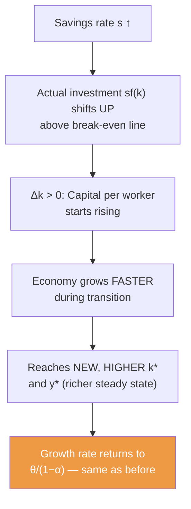
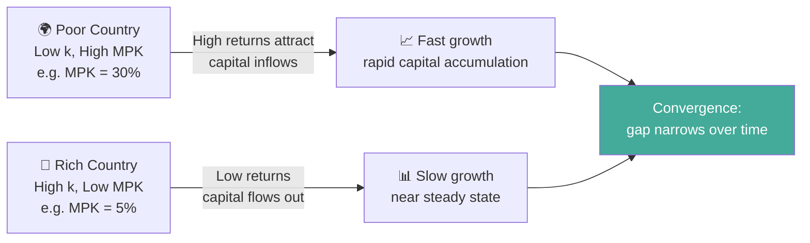
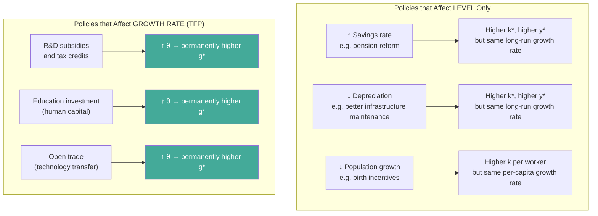

# The Solow Model (Neoclassical Growth Theory)

## The Analogy: A Country is a Bathtub

Picture a bathtub with the tap running and the drain open. Water flowing in is **investment** (savings buying new machines). Water draining out is **depreciation** (machines wearing out) plus the need to equip new workers. The water level is **capital per worker**.

- If the tap runs faster than the drain, the water level rises — the economy is growing.
- If the drain is faster, the level falls.
- Eventually, they equalise and the water level holds steady — that's the **steady state**.

Here's the twist: **gravity** (diminishing returns) means the tap runs slower and slower as the tub fills. No matter how fast you open the tap, the tub always stabilises at some finite level. The only way to keep raising the water level *permanently* is to **redesign the tub** — that's TFP/technology.

---

## Mindmap

```mermaid
mindmap
  root((🏛️ Solow Model))
    📐 Foundation
      Cobb-Douglas Production Function
      Diminishing Marginal Returns
      Capital per worker k = K/L
    ⚖️ Steady State
      Investment = Depreciation + Population growth
      sf(k) = (δ + n + g)k
      Convergence from above and below
    💰 Savings Rate
      Higher savings → higher LEVEL of k and y
      Does NOT raise long-run GROWTH RATE
      Only shifts level, not slope
    🚀 Sustainable Growth
      Only TFP drives permanent per-capita growth
      g* = θ/(1−α)
      Solow Residual = TFP growth
    🌍 Convergence
      Poor countries grow faster (high MPK)
      Conditional on same fundamentals
    🏛️ Policy
      Savings policy = level effect only
      R&D and education = permanent growth
```

---

## Step 1 — The Production Function

The Solow model uses the **Cobb-Douglas production function** as its foundation. Think of it as the economy's recipe for turning inputs into output:

$$Y = A \cdot K^{\alpha} \cdot L^{1-\alpha}$$

| Symbol | Meaning | Typical Value |
|--------|---------|--------------|
| $Y$ | Real aggregate output (GDP) | — |
| $A$ | **Total Factor Productivity (TFP)** — technology and efficiency | Measured as the Solow residual |
| $K$ | Physical capital stock (machines, buildings, infrastructure) | — |
| $L$ | Labour input (workers × hours) | — |
| $\alpha$ | Capital's share of national income | ~0.30 in most economies |
| $1-\alpha$ | Labour's share of national income | ~0.70 |

### Per-Worker Form

Economists divide everything by $L$ to work in **per-worker** terms (lower-case = per worker):

$$y = \frac{Y}{L}, \quad k = \frac{K}{L}$$

$$\boxed{y = A \cdot k^{\alpha}}$$

This is the key equation: output per worker depends on TFP and capital per worker. It's concave (bows downward) because of **diminishing marginal returns** — each additional machine adds less to output.



> [!tip] Mnemonic: "AKAL"
> **A** × **k** to the power **al**pha = **y** (output per worker)
> The exponent α is always *less than 1* — that's what makes the curve bend.

---

## Step 2 — Capital Accumulation

Capital per worker changes each period according to:

$$\Delta k = s \cdot y - (\delta + n) \cdot k$$

| Term | Meaning |
|------|---------|
| $s \cdot y$ | **Actual investment per worker** — savings rate × output per worker |
| $\delta \cdot k$ | Capital lost to **depreciation** (machines wear out) |
| $n \cdot k$ | Capital diluted by **population growth** (new workers need equipping) |
| $(\delta + n) \cdot k$ | **Required investment** to keep $k$ constant |

When technology is growing at rate $\theta$, the full break-even investment per worker (to keep $k$ constant along the balanced growth path) is:

$$\text{Break-even investment} = \left(\delta + n + \frac{\theta}{1-\alpha}\right) \cdot k$$

The economy reaches **steady state** when actual investment equals break-even investment:

$$\boxed{s \cdot f(k^*) = \left(\delta + n + g\right) \cdot k^*}$$

where $g = \theta/(1-\alpha)$ is the steady-state growth rate of $k$ per worker.

---

## Step 3 — The Steady State

The **steady state** (also called the *balanced growth path*) is the long-run equilibrium where:
- $k$ (capital per worker) grows at constant rate $g = \theta/(1-\alpha)$
- $y$ (output per worker) grows at constant rate $g = \theta/(1-\alpha)$
- Total GDP $Y$ grows at $g + n$ (per-capita growth + population growth)

### Why the Steady State Always Exists

Diminishing returns guarantee it. The investment curve $sf(k)$ is concave (flattens), while the break-even line $(\delta + n + g)k$ is straight. A flattening curve must eventually cross a straight line from above — that intersection is $k^*$.



### Key Insight: Convergence to Steady State

- **Poor countries** (low $k$) have a high marginal product of capital (MPK) — machines are scarce and very valuable. Investment exceeds break-even → $k$ rises fast → rapid growth.
- **Rich countries** (high $k$) have a low MPK — machines are abundant. Investment barely exceeds break-even → slow growth.
- This is the Solow model's prediction of **convergence**: poor countries grow faster and eventually catch up to rich ones (conditional on having similar fundamentals).

> [!important] The Golden Rule of Capital
> The **golden rule** capital level maximises consumption per worker in steady state. It occurs where the marginal product of capital equals the break-even rate:
> $$MPK = \delta + n + g$$
> Below the golden rule level: more saving → higher consumption (good).  
> Above the golden rule level: more saving → *lower* consumption (dynamic inefficiency — too many machines, not enough consumption).

---

## Step 4 — The Role of the Savings Rate

This is the most counterintuitive result in the Solow model and a favourite exam topic.

### What Happens When the Savings Rate Increases?



| Effect | Short Run | Long Run |
|--------|-----------|---------|
| Growth **rate** of $y$ | Temporarily higher | Returns to $\theta/(1-\alpha)$ — **unchanged** |
| **Level** of $y$ | Rising | Permanently higher |
| Capital per worker $k$ | Rising | New higher $k^*$ |

> [!warning] The Critical Solow Exam Point
> **Savings rate ↑ → Level of GDP per capita ↑ (permanent) but growth RATE → unchanged (returns to θ/(1−α)).**
> You cannot save your way to a permanently higher growth rate. Only TFP can do that.

---

## Step 5 — The Sustainable Growth Rate

Once in steady state, all per-capita variables grow at the same rate, determined solely by TFP growth:

$$\boxed{g^* = \frac{\theta}{1-\alpha}}$$

| Variable | Steady-State Growth Rate |
|----------|------------------------|
| Output per worker ($y = Y/L$) | $\theta/(1-\alpha)$ |
| Capital per worker ($k = K/L$) | $\theta/(1-\alpha)$ |
| Total output ($Y$) | $\theta/(1-\alpha) + n$ |
| Total capital ($K$) | $\theta/(1-\alpha) + n$ |
| Labour ($L$) | $n$ |
| TFP ($A$) | $\theta$ |

> [!example] Numerical Check
> If $\theta = 1\%$ and $\alpha = 0.30$:
> $$g^* = \frac{0.01}{1 - 0.30} = \frac{0.01}{0.70} \approx 1.43\%$$
> Per-capita output grows at 1.43% per year indefinitely.

### Why Only TFP?

Because capital deepening hits diminishing returns. As $k$ rises, each unit of new capital produces less — eventually the extra output from new machines is just enough to cover their depreciation and equip new workers, with nothing left over to raise living standards further. TFP sidesteps this by making *every* unit of capital more productive — it shifts the production function upward rather than moving along it.

---

## Step 6 — The Solow Residual (TFP Measurement)

Since we can measure $\Delta Y/Y$, $\Delta K/K$, and $\Delta L/L$ in the data, we can back out TFP growth as the **residual** — what's left after accounting for measured input growth:

$$\boxed{\frac{\Delta A}{A} = \frac{\Delta Y}{Y} - \alpha \cdot \frac{\Delta K}{K} - (1-\alpha) \cdot \frac{\Delta L}{L}}$$

This is called the **Solow residual** and is our best empirical measure of technological progress. It captures everything we can't directly observe: better management, new inventions, organisational improvements, learning-by-doing.

> [!note] Solow Residual = TFP Growth = "Measure of our ignorance"
> Robert Solow himself called TFP a "measure of our ignorance" — it's the part of growth we can't explain with capital and labour alone. In practice, TFP growth has accounted for roughly half of long-run growth in developed economies.

---

## Full Worked Numerical Example

> **Given:**
> - TFP level: $A = 10$
> - Capital share: $\alpha = 0.30$
> - Savings rate: $s = 0.20$ (20%)
> - Depreciation rate: $\delta = 0.05$ (5%)
> - Population growth: $n = 0.02$ (2%)
> - TFP growth rate: $\theta = 0.021$ (2.1%)

### Part 1: Sustainable Per-Capita Growth Rate

$$g^* = \frac{\theta}{1-\alpha} = \frac{0.021}{1 - 0.30} = \frac{0.021}{0.70} = \mathbf{3.0\%}$$

### Part 2: Steady-State Capital per Worker $k^*$

At steady state: $s \cdot A \cdot (k^*)^{\alpha} = (\delta + n + g^*) \cdot k^*$

$$0.20 \times 10 \times (k^*)^{0.30} = (0.05 + 0.02 + 0.03) \times k^*$$

$$2(k^*)^{0.30} = 0.10 \times k^*$$

$$20 = (k^*)^{0.70}$$

$$k^* = 20^{1/0.70} = 20^{1.4286} \approx \mathbf{72.3 \text{ units of capital per worker}}$$

### Part 3: Steady-State Output per Worker $y^*$

$$y^* = A \cdot (k^*)^{\alpha} = 10 \times (72.3)^{0.30} \approx 10 \times 3.615 \approx \mathbf{36.15 \text{ units of output per worker}}$$

### Part 4: Effect of Savings Rate Rising from 20% to 25%

The **growth rate** in steady state remains **3.0%** — unchanged.

New steady state: $0.25 \times 10 \times (k^*)^{0.30} = 0.10 \times k^*$

$$2.5(k^*)^{0.30} = 0.10k^* \Rightarrow k^* = 25^{1.4286} \approx \mathbf{100.6}$$

$$y^* = 10 \times (100.6)^{0.30} \approx \mathbf{39.7}$$

| | $s = 20\%$ | $s = 25\%$ |
|-|-----------|-----------|
| $k^*$ (capital/worker) | 72.3 | 100.6 (+39%) |
| $y^*$ (output/worker) | 36.15 | 39.7 (+10%) |
| Long-run growth rate | 3.0% | **3.0%** (unchanged) |

The country is permanently **richer** (higher level) but not permanently **faster** growing.

---

## Convergence: Why Poor Countries Should Grow Faster

### The Marginal Product of Capital (MPK)

From the production function $y = Ak^\alpha$:

$$MPK = \frac{\partial y}{\partial k} = \alpha \cdot A \cdot k^{\alpha - 1} = \frac{\alpha \cdot y}{k}$$

Since $\alpha - 1 < 0$, MPK **falls** as $k$ rises. A country with low capital per worker has a high MPK — each new machine generates a large return. This attracts investment and accelerates growth. A rich country with high $k$ has low MPK — new machines barely move the needle.



### Types of Convergence

| Type | Prediction | Empirical Support |
|------|-----------|-----------------|
| **Absolute** | All countries converge regardless of characteristics | Weak — Sub-Saharan Africa hasn't converged |
| **Conditional** | Countries converge to *their own* steady state (same fundamentals) | Strong — works within similar country groups |
| **Club** | Only countries with right institutions join the rich club | Strong — explains persistent divergence |

> [!tip] Exam Rule
> The Solow model strictly predicts **conditional convergence**, not absolute convergence. Countries with different savings rates, population growth rates, or technology access converge to *different* steady states.

---

## Policy Implications



> [!warning] The Fundamental Policy Limitation of the Solow Model
> Because TFP is **exogenous** (falls from the sky — the model doesn't explain where it comes from), the government has no reliable lever to permanently raise the growth rate. This flaw motivated the development of [[CFA_Glossary/Economic growth#3. Endogenous Growth Theory|Endogenous Growth Theory]], where R&D and education are explicitly modelled as drivers of TFP.

---

## Solow vs. Endogenous Growth: Head-to-Head

| Feature | Solow (Neoclassical) | Endogenous Growth |
|---------|---------------------|-----------------|
| Diminishing returns to capital | **Yes** | **No** (knowledge spillovers) |
| Source of sustained growth | Exogenous TFP | R&D, human capital (explained within model) |
| Savings rate effect on long-run growth | **Level only** | **Permanent growth rate increase** |
| Convergence predicted? | **Yes** (conditional) | **No** |
| Policy effectiveness for growth | Limited | **High** |
| Technology modelled | External | Internal |

---

## Memory Hooks

| Concept | Hook |
|---------|------|
| Steady state = bathtub | Tap (investment) = drain (depreciation + population) → water level stable |
| Savings → level, not rate | "Save more, get richer — not faster" |
| TFP = only sustained driver | "Technology tilts the tub" — shifts the whole curve |
| Convergence | "Poor countries have better returns — capital flows downhill to them" |
| Solow residual | "What's left after you count workers and machines = technology" |
| $g^* = \theta/(1-\alpha)$ | "Theta over the labour share" — if labour is 70%, divide theta by 0.70 |
| Golden rule | "Too many machines is too much of a good thing" |

---

## Quick Formula Sheet

$$y = A k^{\alpha} \quad \text{(per-worker production function)}$$

$$\Delta k = s \cdot y - (\delta + n + g) \cdot k \quad \text{(capital accumulation)}$$

$$sf(k^*) = (\delta + n + g) \cdot k^* \quad \text{(steady state condition)}$$

$$g^* = \frac{\theta}{1-\alpha} \quad \text{(sustainable per-capita growth rate)}$$

$$\frac{\Delta A}{A} = \frac{\Delta Y}{Y} - \alpha \frac{\Delta K}{K} - (1-\alpha)\frac{\Delta L}{L} \quad \text{(Solow residual / TFP growth)}$$

$$MPK = \alpha \cdot A \cdot k^{\alpha-1} = \frac{\alpha \cdot y}{k} \quad \text{(marginal product of capital)}$$

---

## Related Notes

- [[CFA_Glossary/Economic growth]] — full LOS coverage including all three growth theories and growth accounting
- [[Economics and Investment Markets]] — how the business cycle interacts with the growth framework
- [[Currency Exchange Rates Understanding Equilibrium Value]] — interest rate differentials tied to growth and MPK
- [[Discounted Dividend Valuation]] — sustainable growth $g$ feeds directly into the Gordon Growth Model
- [[Free Cash Flow Valuation]] — long-run FCFF growth anchored to potential GDP
- [[Equity Valuation Applications and Processes]] — Grinold-Kroner links equity returns to GDP growth ceiling
