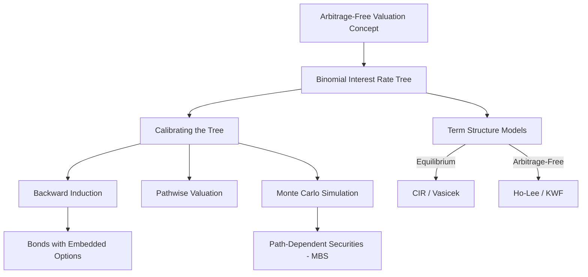

# Module 2 — The Arbitrage-Free Valuation Framework

> [!info] CFA Level 2 · Fixed Income · Volume 6
> This module covers the core framework for valuing fixed-income instruments in a way that prevents riskless profit opportunities ([[Arbitrage|arbitrage]]). Every concept builds on the previous one.

---

## Learning Outcome Statements

| LOS | Topic | Link |
|-----|-------|------|
| 2.03 | [[Binomial Interest Rate Tree|Binomial interest rate tree]]terest rate]] tree framework | [[2.03 - Binomial Interest Rate Tree]] |
| 2.04 | Calibrating the tree to the [[Term structure|term structure]] | [[2.04 - Calibrating the Binomial Tree]] |
| 2.05 | [[Backward Induction|Backward induction]] & option-free bond [[Valuation|valuation]] | [[2.05 - Backward Induction and Option-Free Bonds]] |
| 2.06 | Pathwise [[Valuation|valuation]] | [[2.06 - Pathwise Valuation]] |
| 2.07 | Monte Carlo forward-rate [[Simulation|simulation]] | [[2.07 - Monte Carlo Method]] |
| 2.08 | [[Term Structure Models|Term structure models]] | [[2.08 - Term Structure Models]] |

---

## Conceptual Flow

---

## Key Principles

1. **[[Law of one price|Law of One Price]]** — Two securities with identical cash flows must have the same price
2. **[[Value additivity|Value Additivity]]** — The value of a package equals the sum of the values of its parts
3. **[[No-arbitrage pricing|no-arbitrage]]** — Market prices adjust so that no riskless profit opportunity exists

## Key Formula (Mark Meldrum Formula Sheet)

$$R_u = R_d \times e^{2\sigma\sqrt{t}}$$

See: [[2.03 - Binomial Interest Rate Tree#The Ru = Rd × e²ˢᵗ Relationship]]

---

## Valuation Method Decision Tree

| Bond Type | Best Method | Why |
|-----------|------------|-----|
| Option-free | [[Spot rates|Spot rates]] | Simplest — just discount each CF at its [[Spot rate|spot rate]] |
| Callable / Putable | [[Binomial tree|Binomial tree]] ([[Backward Induction|backward induction]]) | Need to model option exercise at each node |
| Path-[[Dependent|dependent]] (MBS) | [[Monte Carlo simulation|Monte Carlo simulation]] | Cash flows depend on full rate history |

---

## Source Materials
- CFA Program Curriculum 2025, Level 2, Volume 6 — Fixed Income
- Mark Meldrum 2025 L2 Formula Sheet (pp. 23–25)
- Schweser Quick Sheet (p. 4)
