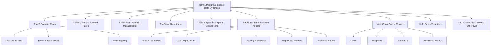

# Module 1: The Term Structure and Interest Rate Dynamics

> [!info] CFA Level 2 — Fixed Income
> **Reading**: The [[Term structure|Term Structure]] and [[Interest rate|Interest Rate]] Dynamics
> **Authors**: Thomas S.Y. Ho, PhD; Sang Bin Lee, PhD; Stephen E. Wilcox, PhD, CFA
> **Lessons**: 1–9 | **LOS Count**: 11

---

## Map of Contents

---

## Lesson 1: Spot Rates, Forward Rates, and the Forward Rate Model

### What Is a Spot Rate?

A [[Spot rate]] (also called a [[zero-coupon rate]] or [[zero rate]]) is the annualized yield on a [[Zero-coupon bond]] — a bond that makes a single payment at maturity and nothing before. Think of it like this: if you lend someone money today and they pay you back in exactly $N$ years with a single lump sum, the implied rate of return is the [[Spot rate|spot rate]] for maturity $N$.

> [!tip] Why [[Spot rates|Spot Rates]] Matter
> [[Spot rates|Spot rates]] are the purest measure of the [[Time value of money]] because they involve no reinvestment — you get one cash flow at one point in time. There's no guesswork about what rate you'll reinvest coupons at, which makes [[Spot rates|spot rates]] the "ground truth" for fixed-income pricing.

**The [[Discount factor|Discount Factor]]**

The [[Discount factor]] for maturity $N$ tells you the present value of \$1 received $N$ years from now:

$$DF_N = \frac{1}{(1 + z_N)^N}$$

Where:
- $DF_N$ = the [[Discount factor|discount factor]] for period $N$ — how many dollars today equal \$1 received at time $N$
- $z_N$ = the [[Spot rate|spot rate]] (annualized) for maturity $N$
- $N$ = number of periods (years)

> [!example] Real-World Analogy
> Imagine you're buying a gift card that can only be redeemed in 3 years. If 3-year [[Spot rates|spot rates]] are 5%, then a "\$100 in 3 years" gift card should cost you $\frac{100}{(1.05)^3} = \$86.38$ today. The [[Discount factor|discount factor]] is 0.8638.

The set of all discount factors across maturities is the [[Discount function]]. The set of all spot rates across maturities is the [[Spot curve]] (also called the [[Spot yield curve]] or [[term structure of interest rates]]). They contain the same information — knowing one lets you derive the other.

---

### What Is a Forward Rate?

A [[Forward rate]] is an [[Interest rate|interest rate]] agreed upon *today* for a loan that *starts in the future*. The notation $f_{A,B-A}$ means: a [[Forward rate|forward rate]] for a loan that begins at time $A$ and has a tenor (length) of $B - A$ periods.

> [!example] Real-World Analogy
> Suppose you know you'll need to borrow money one year from now for a two-year period. You could lock in a rate today for that future loan. That locked-in rate is the [[Forward rate|forward rate]] $f_{1,2}$.

**The [[Forward pricing model|Forward Pricing Model]]**

The [[Forward pricing model]] links today's [[Spot prices|spot prices]] (discount factors) to forward prices:

$$DF_B = DF_A \times F_{A,B-A}$$

In plain English: *The price today of \$1 delivered at time $B$ must equal the price of \$1 delivered at time $A$ multiplied by the [[Forward price|forward price]] from $A$ to $B$*. If this didn't hold, you could create an [[Arbitrage]] — a riskless profit.

**The [[Forward rate model|Forward Rate Model]]**

The [[Forward rate model]] connects spot rates and forward rates:

$$(1 + z_B)^B = (1 + z_A)^A \times (1 + f_{A,B-A})^{B-A}$$

Where:
- $z_A$, $z_B$ = spot rates for maturities $A$ and $B$
- $f_{A,B-A}$ = the [[Forward rate|forward rate]] starting at $A$ with tenor $B - A$

Solving for the [[Forward rate|forward rate]]:

$$f_{A,B-A} = \left[\frac{(1 + z_B)^B}{(1 + z_A)^A}\right]^{\frac{1}{B-A}} - 1$$

> [!note] What the Formula Is Saying
> The return from investing for $B$ years at rate $z_B$ must equal the return from investing for $A$ years at $z_A$ and then rolling into a [[Forward contract|forward contract]] from $A$ to $B$. If not, [[Arbitrageurs|arbitrageurs]] would exploit the difference.

**Connecting Spot Rates to a Chain of Forward Rates**

Any long-term [[Spot rate|spot rate]] can be decomposed into a chain of one-period forward rates:

$$(1 + z_T)^T = (1 + z_1)(1 + f_{1,1})(1 + f_{2,1})(1 + f_{3,1})\cdots(1 + f_{T-1,1})$$

This means:

$$z_T = \left[(1 + z_1)(1 + f_{1,1})(1 + f_{2,1})\cdots(1 + f_{T-1,1})\right]^{1/T} - 1$$

The [[Spot rate|spot rate]] is a **geometric average** of the current short rate and all the implied one-period forward rates leading up to maturity $T$.

> [!tip] The "Average vs. Marginal" Intuition
> Think of spot rates as a cumulative GPA and forward rates as the grade for each individual semester. When the [[Spot curve|spot curve]] slopes upward (GPA is rising), the marginal semester grades (forward rates) must be *above* the cumulative average. This is why **forward curves lie above upward-sloping spot curves** and below downward-sloping ones.

---

### Worked Example: Calculating Forward Rates

**Given**: $z_1 = 9\%$, $z_2 = 10\%$, $z_3 = 11\%$

**Find** $f_{1,1}$ (the one-year forward rate, one year from now):

$$\begin{align}
(1 + z_2)^2 &= (1 + z_1)(1 + f_{1,1}) \\
(1.10)^2 &= (1.09)(1 + f_{1,1}) \\
1 + f_{1,1} &= \frac{1.21}{1.09} = 1.1101 \\
f_{1,1} &= 11.01\%
\end{align}$$

**Find** $f_{2,1}$ (the one-year forward rate, two years from now):

$$\begin{align}
(1 + z_3)^3 &= (1 + z_2)^2(1 + f_{2,1}) \\
(1.11)^3 &= (1.10)^2(1 + f_{2,1}) \\
1 + f_{2,1} &= \frac{1.3676}{1.21} = 1.1303 \\
f_{2,1} &= 13.03\%
\end{align}$$

**Verify via [[Geometric mean|geometric mean]]**:

$$z_3 = \left[(1.09)(1.1101)(1.1303)\right]^{1/3} - 1 \approx 11\% \checkmark$$

Notice the forward rates (9%, 11.01%, 13.03%) are increasing — they must be, because the [[Spot curve|spot curve]] is upward sloping.

---

### Relationships Between Spot and Forward Curves

| [[Spot curve|Spot Curve]] Shape | [[Forward curve|Forward Curve]] Position | Why? |
|---|---|---|
| Upward sloping ($z_B > z_A$) | [[Forward curve|Forward curve]] lies **above** [[Spot curve|spot curve]] | Marginal rates must exceed the rising average |
| Downward sloping ($z_B < z_A$) | Forward curve lies **below** spot curve | Marginal rates must be below the falling average |
| Flat | Forward curve **equals** spot curve | All rates are the same |

---

### Bootstrapping: Extracting Spot Rates from the Par Curve

The [[Par curve]] shows the coupon rates at which bonds trade at par (100) for each maturity. But we need [[Spot rates]] for valuation. [[Bootstrapping]] is the process of extracting spot rates from the par curve, working from the shortest maturity to the longest.

**Why it works**: A one-year par bond's coupon rate equals the one-year spot rate (since it's just one cash flow). Then you use the known one-year spot rate to solve for the two-year spot rate from the two-year par bond, and so on.

**Step-by-Step Example**:

Given par rates: 1-year = 5%, 2-year = 5.97%, 3-year = 6.91%, 4-year = 7.81%

**Step 1**: $z_1 = 5\%$ (directly from the 1-year par rate)

**Step 2**: Use the 2-year par bond (coupon = 5.97%):

$$1 = \frac{0.0597}{1.05} + \frac{1.0597}{(1 + z_2)^2}$$

Solving: $z_2 = 6\%$

**Step 3**: Use the 3-year par bond (coupon = 6.91%):

$$1 = \frac{0.0691}{1.05} + \frac{0.0691}{(1.06)^2} + \frac{1.0691}{(1 + z_3)^3}$$

Solving: $z_3 = 7\%$

**Step 4**: Use the 4-year par bond (coupon = 7.81%):

$$1 = \frac{0.0781}{1.05} + \frac{0.0781}{(1.06)^2} + \frac{0.0781}{(1.07)^3} + \frac{1.0781}{(1 + z_4)^4}$$

Solving: $z_4 = 8\%$

> [!warning] Key Detail
> [[Bootstrapping|Bootstrapping]] uses **forward substitution** — from earliest to latest maturity. An assistant once said "backward substitution," which is incorrect. You must know the shorter rates before solving for longer ones.

> [!note] Flat [[Par curve|Par Curve]] Implication
> If the [[Par curve|par curve]] is flat (say, all at 5%), then [[Bootstrapping|bootstrapping]] produces spot rates that are also all 5%, and forward rates are also all 5%. A flat [[Par curve|par curve]] forces flat spot and forward curves at the same level.

---

## Lesson 2: YTM in Relation to Spot and Forward Rates

### What Is Yield-to-Maturity?

[[Yield-to-maturity]] (YTM) is the single [[Discount rate|discount rate]] that, when applied to all of a bond's future cash flows, produces the bond's market price. It's the "one number summary" of a bond's return — but it's an imperfect one.

**YTM as a Weighted Average of Spot Rates**

For a coupon bond, the YTM is best thought of as a complex weighted average of the spot rates that apply to each of its cash flows. The weights depend on the timing and magnitude of each cash flow relative to the bond's total present value.

$$\text{Price} = \frac{C}{(1+y)^1} + \frac{C}{(1+y)^2} + \cdots + \frac{C + \text{Par}}{(1+y)^T}$$

> [!warning] YTM ≠ Expected Return
> YTM only equals the realized return if (1) the bond is held to maturity, (2) there's no default, and (3) all coupons are reinvested at the YTM. Condition 3 is almost never met. Even if forward rates are realized as future spot rates, the expected return won't equal the YTM unless the [[Yield curve|yield curve]] is flat.

---

## Lesson 3: Active Bond Portfolio Management

### Forward Rates and Active Management

Active bond portfolio managers believe that today's forward rates will **not** be realized as future spot rates. If forward rates *were* realized, every bond would earn the same one-period return (the current one-period spot rate), and there would be no advantage to [[Active management|active management]].

> [!tip] The Core Insight for Active Managers
> If you believe future spot rates will be *lower* than the forward rates currently priced into the market, bonds are undervalued (the market is discounting too heavily). You should buy longer-term bonds to profit from the price increase when your view materializes.

### Rolling Down the Yield Curve

The [[roll-down return]] strategy involves buying a bond with a maturity *longer* than your investment horizon and selling it before maturity. With an upward-sloping, stable [[Yield curve|yield curve]], the bond "rolls down" to lower yields (higher prices) as it approaches maturity.

> [!example] Real-World Example
> **Scenario**: You have a 2-year investment horizon. The 2-year spot rate is 3%, and the 4-year spot rate is 4.75%.
>
> **Strategy**: Instead of buying a 2-year bond yielding 3%, you buy a 4-year bond yielding 4.75%. After 2 years, if the [[Yield curve|yield curve]] hasn't changed, your 4-year bond is now a 2-year bond priced at the 2-year yield of 3%. The decline in yield from 4.75% to 3% generates a capital gain *on top of* the higher coupon.
>
> **Requirement**: The [[Yield curve|yield curve]] must remain stable. If rates rise, the strategy fails.

---

## Lesson 4: The Swap Rate Curve

### What Is the Swap Curve?

The [[Swap rate curve]] (or [[Swap curve]]) is the [[Term structure|term structure]] of fixed rates on [[interest rate swaps]]. In a standard swap, one party pays a fixed rate (the [[Swap rate]]) and the other pays a floating rate (based on a [[market reference rate]] like [[SOFR]]).

The [[Swap curve|swap curve]] is a type of [[Par curve]] because swaps are structured so that no money [[Exchanges|exchanges]] hands at initiation — the present values of the fixed and floating legs are equal, making the swap "at par."

**Key Formula**: The [[Swap rate|swap rate]] $s_T$ satisfies:

$$\sum_{t=1}^{T} \frac{s_T}{(1 + z_t)^t} + \frac{1}{(1 + z_T)^T} = 1$$

Where:
- The left side is the present value of the fixed leg (coupons at rate $s_T$ plus the notional repayment)
- The right side equals 1 because the floating leg of a swap at initiation always has a present value equal to par

> [!note] Why a Separate Curve?
> Government spot curves and swap curves are both benchmarks for the [[Time value|time value]]ue of money|[[Time value|time value]] of money]], but they reflect different [[Credit risk|credit risk]] levels. Government curves are default-risk-free; swap curves incorporate the [[Credit risk|credit risk]] of the banking sector (since swaps are between banks/financial institutions). Countries with illiquid government bond markets often rely on the [[Swap curve|swap curve]] as the primary [[Benchmark|benchmark]].

### Why Use the Swap Curve?

1. **[[Liquidity|Liquidity]]**: The swap market ($350 trillion+ in notional outstanding) is extremely liquid, especially at certain maturities where government bonds may be scarce
2. **Comparability**: Swap rates are driven by private-sector rates, making them more comparable across countries than government yields (which are affected by country-specific fiscal situations)
3. **Hedging**: Banks use swaps to convert fixed-rate [[Liabilities|liabilities]] to floating-rate, so the [[Swap curve|swap curve]] naturally becomes their [[Valuation|valuation]] [[Benchmark|benchmark]]
4. **Maturity spectrum**: Swap maturities extend to 50+ years in major [[Currencies|currencies]]

---

## Lesson 5: The Swap Spread and Spreads as a Price Quotation Convention

### Swap Spread

The [[Swap spread]] is the difference between the [[Swap rate|swap rate]] and the yield on the [[On-the-run|on-the-run]] (most recently issued) government bond of the same maturity:

$$\text{Swap Spread}_T = \text{Swap Rate}_T - \text{Treasury Yield}_T$$

> [!example] Calculating a [[Swap spread|Swap Spread]]
> If the 5-year [[Swap rate|swap rate]] is 2.50% and the 5-year Treasury yields 2.00%, the [[Swap spread|swap spread]] is 50 bps (0.50%).

**What does it measure?** The [[Swap spread|swap spread]] captures the market's perceived credit and [[Liquidity risk|liquidity risk]] relative to the default-risk-free government rate. It typically widens during recessions (higher perceived risk) and narrows during expansions.

> [!warning] Negative Swap Spreads
> After the 2008 financial crisis, 30-year US swap spreads turned *negative* — meaning the government was paying more than the [[Swap rate|swap rate]]. This counterintuitive result arose because of increased regulatory capital requirements on swap dealers, strong demand for long-duration assets, and tighter [[Liquidity|liquidity]]. Negative swap spreads have persisted in certain maturities.

### Other Important Spreads

**[[I-spread]] ([[Interpolated spread|Interpolated Spread]])**: The difference between a bond's yield and the interpolated swap rate of the same maturity. Used to express how much extra yield a specific bond offers over the [[Swap curve|swap curve]].

**[[CFA_Glossary/Z-spread]] (Zero-[[Volatility|Volatility]] Spread)**: A constant spread added to every point on the government spot curve such that the present value of a bond's cash flows equals its market price. The Z-spread is more precise than the I-spread because it accounts for the shape of the entire spot curve rather than just one point.

**[[TED spread]]**: The difference between 3-month MRR (Market Reference Rate, formerly LIBOR) and the 3-month T-bill rate.

$$\text{TED Spread} = \text{3-month MRR} - \text{3-month T-bill rate}$$

- A barometer of perceived **credit and [[Liquidity risk|liquidity risk]]** in the banking sector
- Widens during financial stress (e.g., spiked during COVID-19 in early 2020)
- Named from T-bill + Eurodollar (ED) futures ticker

**[[MRR-OIS Spread]]**: The difference between MRR and the [[Overnight Indexed Swap]] (OIS) rate.

$$\text{MRR-OIS Spread} = \text{MRR} - \text{OIS rate}$$

- The OIS rate reflects the geometric average of overnight unsecured rates (like the [[Federal funds rate]])
- This spread isolates [[Credit risk|credit risk]] in the interbank lending market because both rates have similar maturities but different credit exposures
- [[SOFR]] (Secured Overnight Financing Rate) has gained prominence as a secured alternative to survey-based LIBOR

---

## Lesson 6: Traditional Theories of the Term Structure

### 1. Unbiased (Pure) Expectations Theory

**Core idea**: Forward rates are **unbiased predictors** of future spot rates. The yield curve's shape reflects only market expectations about future interest rates — there are no risk premiums.

$$f_{A,B-A} = E[z_{B-A} \text{ at time } A]$$

**Implication**: An upward-sloping curve means the market expects rates to *rise*. A downward-sloping curve means rates are expected to *fall*.

**Limitation**: Ignores risk — investors should demand extra compensation for the greater uncertainty of lending long-term.

### 2. Local Expectations Theory

**Core idea**: Over a **single period**, every bond earns the same return — the risk-free rate. This is a more refined version of expectations theory that holds only for very short holding periods.

**Implication**: A five-year [[Zero-coupon bond|zero-coupon bond]] and a two-year [[Zero-coupon bond|zero-coupon bond]] should earn the same return over the next month. This holds approximately in [[Arbitrage|arbitrage]]ge-free models|[[Arbitrage|arbitrage]]-free models]] but not over longer horizons.

### 3. Liquidity Preference Theory

**Core idea**: Investors demand a [[Liquidity premium]] to hold longer-term bonds because of their greater [[Interest rate risk|interest rate risk]]. This premium increases with maturity.

$$f_{A,B-A} = E[z_{B-A} \text{ at time } A] + \text{Liquidity Premium}$$

**Implication**: Forward rates are **upwardly biased** estimates of future spot rates. The yield curve tends to be upward sloping even if rates are expected to stay flat, because of the [[Liquidity premium|liquidity premium]]. A downward-sloping curve can still exist if expected rate declines are large enough to offset the positive [[Liquidity premium|liquidity premium]].

> [!example] Real-World Analogy
> Think of a 30-year mortgage. Even if the bank expects interest rates to be roughly flat, it charges more for a 30-year loan than a 5-year loan. Why? Because the bank bears more risk — rates could move against it over 30 years. That extra charge is the [[Liquidity|liquidity]]ty premium|[[Liquidity|liquidity]] premium]].

### 4. Segmented Markets Theory

**Core idea**: The yield curve's shape is determined by the supply and demand for bonds within distinct maturity segments. Investors and borrowers have strict maturity preferences and won't leave their segment regardless of yields elsewhere.

**Implication**: The curve's shape has nothing to do with expectations — it's purely about who's buying and selling in each maturity bucket. A pension fund needs 30-year bonds regardless of the yield; a [[Money market|money market]] fund needs short-term paper.

**Limitation**: Too extreme — in practice, investors *will* move across maturities if the yield differential is attractive enough.

### 5. Preferred Habitat Theory

**Core idea**: A refinement of [[Segmented markets theory|segmented markets theory]]. Investors have preferred maturity segments but *will* deviate if they receive sufficient compensation. It combines expectations with maturity-specific supply/demand dynamics.

**Implication**: The yield curve reflects both expectations about future rates *and* premiums required to entice investors away from their preferred maturities. This is the most flexible theory and is generally considered the most realistic.

### Theory Comparison Table

| Theory | Forward Rates Are... | [[Risk premium|Risk Premium]]? | Curve Shape Driven By... |
|---|---|---|---|
| Pure Expectations | Unbiased forecasts of future spots | None | Rate expectations only |
| Local Expectations | Equal short-term returns | None (short term) | [[Arbitrage-free pricing|Arbitrage-free pricing]] |
| Liquidity Preference | Upwardly biased forecasts | Yes, increasing with maturity | Expectations + [[Risk premium|risk premium]] |
| Segmented Markets | Unrelated to expectations | N/A | Supply/demand per segment |
| Preferred Habitat | Biased, but flexibly so | Yes, varies by segment | Expectations + supply/demand + premiums |

---

## Lesson 7: Yield Curve Factor Models

### The Three-Factor Model

Research by Litterman and Scheinkman (1991) found that yield curve movements can be explained by three [[Independent|independent]] factors:

1. **Level** ([[Parallel shift|parallel shift]]): All rates move up or down by a similar amount. Explains **>75%** of total yield curve variance.
2. **[[Steepness|Steepness]]** (twist): Short rates and long rates move in opposite directions or by different magnitudes. Short rates typically move more.
3. **[[Curvature|Curvature]]** (butterfly): Short and long rates move together while intermediate rates move the opposite way (or vice versa). Has the smallest impact.

The model for portfolio value changes:

$$\frac{\Delta P}{P} \approx -D_L \Delta x_L - D_S \Delta x_S - D_C \Delta x_C$$

Where:
- $D_L$, $D_S$, $D_C$ = portfolio sensitivities to level, [[Steepness|steepness]], and [[Curvature|curvature]]
- $\Delta x_L$, $\Delta x_S$, $\Delta x_C$ = changes in each factor

> [!example] Real-World Interpretation
> **Bearish flattening**: The Fed raises short-term rates (level up), but long-term rates rise less because the market expects the tightening to slow [[Economic growth|economic growth]]. This involves changes in both level and [[Steepness|steepness]].
>
> **Bullish flattening (flight to quality)**: During a crisis, investors pile into long-term Treasuries, pushing long rates down more than short rates. Long-term yields fall as investors seek safety.

---

## Lesson 8: Managing Yield Curve Risks

### Effective Duration

[[CFA_Glossary/Effective duration]] measures a bond's sensitivity to a **[[Parallel shift|parallel shift]]** of the entire [[Benchmark|benchmark]] yield curve. It works for all bond types, including those with [[Embedded options|embedded options]].

$$\text{EffDur} = \frac{PV_{-} - PV_{+}}{2 \times \Delta \text{Curve} \times PV_0}$$

**Limitation**: Only captures parallel (level) risk. Doesn't address twists or [[Curvature|curvature]] changes.

### Key Rate Duration

[[CFA_Glossary/Key rate duration]] measures a bond's sensitivity to a change in the yield at a *specific* maturity point, holding all other points constant.

$$\frac{\Delta P}{P} \approx -\text{KeyDur}_1 \Delta z_1 - \text{KeyDur}_5 \Delta z_5 - \text{KeyDur}_{10} \Delta z_{10}$$

Key property: **The sum of all [[Key rate durations|key rate durations]] equals the [[Effective Duration|effective duration]].** If all key rates shift by the same amount (a [[Parallel shift|parallel shift]]), the portfolio's response is exactly what [[Effective Duration|effective duration]] predicts.

> [!note] [[Shaping risk|Shaping Risk]]
> [[Shaping risk]] is the risk from non-parallel yield curve changes. [[Effective Duration|Effective duration]] can't measure it, but [[Key rate durations|key rate durations]] and the three-factor model can. This is why both tools are essential for sophisticated [[Risk management|risk management]].

---

## Lesson 9: Yield Volatility and Macroeconomic Variables

### The Volatility Term Structure

[[Yield volatility]] measures how much a given [[Interest rate|interest rate]] fluctuates, annualized as:

$$\sigma(t,T) = \frac{\sigma[\Delta r(t,T) / r(t,T)]}{\sqrt{\Delta t}}$$

Key facts:
- **Short-term rates are more volatile** than long-term rates (e.g., 3-month T-bill vol ~35% vs. 30-year vol ~12% in the 2005–2007 period)
- **Short-term vol** is driven by uncertainty about **[[Monetary policy|monetary policy]]**
- **Long-term vol** is driven by uncertainty about the **real economy and [[Inflation|inflation]]**
- Despite lower yield [[Volatility|volatility]], **long-term bond prices** are more volatile due to higher duration

### Macroeconomic Drivers of Interest Rates

The [[bond risk premium]] is the expected [[Excess return|excess return]] of a long-term bond over an equivalent short-term bond. Key macro drivers:

| Factor | Effect on Rates | Mechanism |
|---|---|---|
| **[[Inflation|Inflation]] expectations rising** | Rates ↑, curve steepens | Nominal rates = real rate + [[Inflation premium|inflation premium]] |
| **Strong GDP growth** | Long rates ↑, curve steepens | Higher demand for capital, higher [[Expected inflation|expected inflation]] |
| **Monetary tightening** (Fed hikes) | Short rates ↑ more than long rates | Bearish flattening |
| **Flight to quality** (crisis) | Long rates ↓ more than short rates | Bullish flattening |
| **Falling budget deficits** | Rates ↓ | Less government borrowing = less supply of bonds |
| **Central bank asset purchases** | Long rates ↓ | Increased demand for long-term bonds |

### Common Yield Curve Trades

- **Rates expected to fall**: **Extend** portfolio duration (buy longer bonds) to benefit from price appreciation
- **Rates expected to rise**: **Shorten** portfolio duration
- **Curve expected to steepen**: Sell long-term bonds, buy short-term bonds
- **Curve expected to flatten**: Buy long-term bonds, sell short-term bonds

---

## Key Takeaways

> [!summary]
> - Spot rates are geometric averages of forward rates
> - Forward curves lie above (below) upward-sloping (downward-sloping) spot curves
> - [[Bootstrapping|Bootstrapping]] extracts spot rates from the [[Par curve|par curve]] using forward substitution
> - Active managers profit by identifying when forward rates misprice future spot rates
> - The swap curve is an alternative [[Benchmark|benchmark]] reflecting private-sector [[Credit risk|credit risk]]
> - Swap spreads, TED spreads, and MRR-OIS spreads each measure different types of credit/[[Liquidity risk|liquidity risk]]
> - Five theories explain the [[Term structure|term structure]] — liquidity preference and preferred habitat are most realistic
> - Yield curve changes decompose into level (~75%), [[Steepness|steepness]], and [[Curvature|curvature]] factors
> - [[Key rate durations|Key rate durations]] capture [[Shaping risk|shaping risk]] that [[Effective Duration|effective duration]] misses
> - Short-term yield [[Volatility|volatility]] reflects [[Monetary policy|monetary policy]] uncertainty; long-term reflects real economy/[[Inflation|inflation]]

---

## Formula Reference

| Formula | Description |
|---|---|
| $DF_N = \frac{1}{(1+z_N)^N}$ | [[Discount factor]] from [[Spot rate]] |
| $(1+z_B)^B = (1+z_A)^A(1+f_{A,B-A})^{B-A}$ | [[Forward rate model]] |
| $z_T = [(1+z_1)(1+f_{1,1})\cdots(1+f_{T-1,1})]^{1/T} - 1$ | Spot as [[Geometric mean|geometric mean]] of forwards |
| $\text{Swap Spread} = s_T - y_T^{\text{gov}}$ | [[Swap spread]] |
| $\text{TED} = \text{3m MRR} - \text{3m T-bill}$ | [[TED spread]] |
| $\frac{\Delta P}{P} \approx -D_L\Delta x_L - D_S\Delta x_S - D_C\Delta x_C$ | [[Three-factor model]] |
