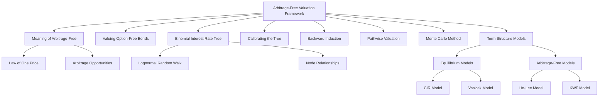

# Module 2: The Arbitrage-Free Valuation Framework

> [!info] CFA Level 2 — Fixed Income
> **Reading**: The [[Arbitrage|Arbitrage]]ge-free [[Valuation|valuation]]|[[Arbitrage|Arbitrage]]-Free Valuation]]on Framework|[[Arbitrage-free valuation|Arbitrage-Free Valuation]] Framework]]on]] Framework
> **Author**: Steven V. Mann, PhD
> **Lessons**: 1–8 | **LOS Count**: 9

---

## Map of Contents



---

## Lesson 1: Introduction — What Does "Arbitrage-Free" Mean?

### The Core Principle

[[Arbitrage-free valuation]] means pricing securities so that there are no opportunities to earn a risk-free profit with zero net investment. If such opportunities existed, traders would exploit them until prices adjusted and the opportunity vanished.

> [!example] Real-World Analogy
> Imagine a gas station sells gasoline for \$3/gallon, but the station across the street sells the identical gasoline for \$2.80. You'd buy all the gas at \$2.80 and sell it at \$3.00, pocketing \$0.20 per gallon risk-free. In financial markets, this process happens in milliseconds and drives prices to equilibrium.

### The Law of One Price

The [[Law of one price]] states that two assets producing identical cash flows must have the same price. For bonds: if you can replicate a bond's cash flows using a portfolio of [[Zero-coupon bonds]], the bond's price must equal the value of that replicating portfolio.

### Types of Arbitrage Opportunities

1. **Value additivity violation**: A bond's market price differs from the sum of the present values of its individual cash flows (each discounted at the appropriate [[Spot rate]]). You buy the cheap version and sell the expensive version.

2. **Dominance principle violation**: One asset costs the same or less than another but delivers greater cash flows in some states and no less in any state. You buy the dominant asset and sell the dominated one.

> [!example] Dominance Example
> Asset A costs \$500 and pays \$525 in one year. Asset B costs \$1,000 and pays \$1,100 in one year. Asset A returns 5%, Asset B returns 10%. With the same risk profile, you should buy two units of Asset A (\$1,000 total → \$1,050) versus one unit of Asset B (\$1,000 → \$1,100). Asset B dominates two units of Asset A. But if B costs *less* than A per unit of return, there's an arbitrage.

### Implication for Bond Valuation

The arbitrage-free price of any bond is the present value of its cash flows discounted at the corresponding [[Spot rates]]:

$$\text{Price} = \frac{C}{(1+z_1)} + \frac{C}{(1+z_2)^2} + \cdots + \frac{C + \text{Par}}{(1+z_T)^T}$$

Where each cash flow gets its own discount rate ($z_t$) from the [[Spot curve]]. Using a single [[yield-to-maturity]] to discount all cash flows gives the same answer only by coincidence when the curve is flat.

---

## Lesson 2: Arbitrage-Free Valuation for Option-Free Bonds

For an option-free, fixed-rate coupon bond, the arbitrage-free value is simply the sum of present values using [[Spot rates]]:

**Worked Example**: Value a 4-year bond with a 2% coupon, given spot rates: $z_1 = 1\%$, $z_2 = 1.2012\%$, $z_3 = 1.2515\%$, $z_4 = 1.4044\%$.

$$\text{Price} = \frac{2}{(1.01)^1} + \frac{2}{(1.012012)^2} + \frac{2}{(1.012515)^3} + \frac{102}{(1.014044)^4} = 102.3254$$

Each cash flow is discounted at the spot rate matching its maturity. The bond trades above par because its 2% coupon exceeds the prevailing spot rates.

> [!tip] Why Not Just Use YTM?
> For option-free bonds, spot-rate pricing and YTM pricing give the same answer. The difference becomes critical when bonds have embedded options or when rates are volatile — then only the [[Binomial tree]] approach properly captures the value of optionality.

---

## Lesson 3: The Binomial Interest Rate Tree

### What Is a Binomial Tree?

A [[Binomial Interest Rate Tree]] is a visual model of possible future one-period interest rates. At each time step, the rate can go "up" (higher) or "down" (lower), each with a 50% probability. The tree is based on a [[lognormal random walk]], which means:

- Interest rates can never go negative (a key advantage of lognormal vs. normal distributions)
- Rate changes are proportional to the current level — when rates are high, the absolute moves are larger
- The [[Standard deviation]] of the one-year rate = $i_0 \times \sigma$ (where $i_0$ is the current rate and $\sigma$ is volatility)

### Node Relationships

In a lognormal tree, the relationship between the upper and lower rates at any time step is:

$$R_u = R_d \times e^{2\sigma}$$

Where:
- $R_u$ = the rate at the upper node
- $R_d$ = the rate at the lower node
- $\sigma$ = assumed volatility
- $e^{2\sigma}$ = the proportional spread factor

> [!note] Why $e^{2\sigma}$?
> In log space, the upper and lower rates are symmetric around a centering rate. The upper rate is one standard deviation above ($+\sigma$), and the lower is one below ($-\sigma$). The *distance* between them is $2\sigma$ in log space, so in level space: $R_u / R_d = e^{2\sigma}$.

For a **two-step tree**, if the middle rate at Time 2 is $i_2$:
- Upper rate: $i_2 \times e^{2\sigma}$
- Lower rate: $i_2 \times e^{-2\sigma}$ (or equivalently, $i_2 / e^{2\sigma}$)

> [!warning] Common Mistake
> The *lowest* node in a two-step tree uses $e^{-2\sigma}$ (not $e^{-\sigma}$), because it is two steps below the centering rate. Each step contributes $\sigma$ in log space.

### Structure of a Four-Year Tree

```
Time 0    Time 1    Time 2    Time 3
                              i₃e³ᵟ
                    i₂e²ᵟ
                              i₃e¹ᵟ
          i₁e¹ᵟ
                              i₃e¹ᵟ  (recombining)
i₀                 i₂
                              i₃e⁻¹ᵟ
          i₁e⁻¹ᵟ
                              i₃e⁻¹ᵟ (recombining)
                    i₂e⁻²ᵟ
                              i₃e⁻³ᵟ
```

The tree "recombines" — an up-then-down move reaches the same node as a down-then-up move. This keeps the tree manageable (instead of an exponentially growing bush).

### Two Methods for Estimating Volatility

1. **[[Historical volatility]]**: Using past [[Interest rate|interest rate]] data. Simple but assumes the past is indicative of the future.
2. **[[Implied volatility]]**: Derived from market prices of [[Interest rate|interest rate]] [[Derivatives|derivatives]] (e.g., [[swaptions]], [[caps]], [[floors]]). Reflects the market's current view of future [[Volatility|volatility]].

---

## Lesson 4: Calibrating the Binomial Tree to the Term Structure

### Why Calibrate?

A [[Binomial tree|binomial tree]] needs to be **calibrated** to the current market — meaning it must reproduce the observed prices of [[Benchmark|benchmark]] bonds. Without calibration, the tree would be internally [[Consistent|consistent]] but disconnected from reality. A calibrated tree is [[arbitrage-free]] by construction.

### The Calibration Process

**Goal**: Find the interest rates at each node such that the tree correctly prices all [[Benchmark|benchmark]] (par) bonds.

**Process** (iterative, maturity by maturity):

**Step 1**: Set the Time 0 rate equal to the current one-year par/[[Spot rate|spot rate]]. (For the first period, par, spot, and forward rates are all identical.)

**Step 2**: For Time 1, use trial-and-error (or Excel Solver) to find rates that:
- Are [[Consistent|consistent]] with the [[Volatility|volatility]] assumption: $R_{1,u} = R_{1,d} \times e^{2\sigma}$
- Produce a value of 100 (par) for the two-year [[Benchmark|benchmark]] bond when valued via [[Backward Induction|backward induction]]

**Step 3**: For Time 2, repeat — find three rates (upper, middle, lower) [[Consistent|consistent]] with the [[Volatility|volatility]] assumption that price the three-year [[Benchmark|benchmark]] bond at par.

Continue for each maturity.

### Worked Example

**Given**: Par rates: 1-year = 2%, 2-year = 3%, 3-year = 4%. [[Spot rates|Spot rates]]: $S_0 = 2\%$, $S_1 = 3.015\%$, $S_2 = 4.055\%$. Forward rates: $F_0 = 2\%$, $F_1 = 4.040\%$, $F_2 = 6.166\%$. [[Volatility|Volatility]] $\sigma = 15\%$.

**Time 0**: $i_0 = 2.000\%$

**Time 1**: Start with a trial for $R_{1,d}$ below the [[Forward rate|forward rate]] of 4.040% — say 3.500%. Then $R_{1,u} = 3.500\% \times e^{2 \times 0.15} = 4.725\%$.

Value the 2-year benchmark (3% coupon) using [[Backward Induction|backward induction]]:
- At Time 2: both nodes pay 103 (coupon + par)
- At upper Time 1 node: $\frac{103}{1.04725} = 98.427$
- At lower Time 1 node: $\frac{103}{1.03500} = 99.573$ (approximately)
- At Time 0: $\frac{3 + 0.5(98.427) + 0.5(99.573)}{1.02}$

Iterate until the Time 0 value = 100. The calibrated rates turn out to be $R_{1,u} = 4.646\%$ and $R_{1,d} = 3.442\%$.

**Verification**:
$$\frac{103}{1.04646} = 98.427$$
$$\frac{103}{1.03442} = 99.573$$
$$\frac{3 + 0.5(98.427) + 0.5(99.573)}{1.02} = 100.000 \checkmark$$

**Time 2**: Start with the [[Forward rate|forward rate]] of 6.166% as the middle trial rate. The upper trial is $6.166\% \times e^{2(0.15)} = 8.323\%$ and the lower is $6.166\% / e^{2(0.15)} = 4.568\%$. Iterate until the 3-year par bond prices at 100. The calibrated rates are **8.167%, 6.050%, 4.482%**.

### Effect of Volatility on the Tree

| Volatility | Effect on Tree |
|---|---|
| Higher $\sigma$ | Rates spread farther apart from the [[Forward curve|forward curve]] |
| Lower $\sigma$ | Rates converge toward the [[Implied forward rates|implied forward rates]] |
| $\sigma = 0$ | The tree **collapses to the implied [[Forward curve|forward curve]]** exactly |

---

## Lesson 5: Valuing an Option-Free Bond with Backward Induction

### Backward Induction

[[Backward Induction]] is the process of working from the known values at maturity *backward* to the present to find the bond's current value.

**At each node, the value is**:

$$V = \frac{C + 0.5 \times V_H + 0.5 \times V_L}{1 + i}$$

Where:
- $C$ = coupon payment
- $V_H$ = bond value at the higher-rate node one period ahead
- $V_L$ = bond value at the lower-rate node one period ahead
- $i$ = the one-period rate at the current node
- 0.5 = [[Probability|probability]] of each outcome (by construction in a lognormal tree)

> [!tip] Why 50/50 Probabilities?
> The tree uses [[Risk-neutral probabilities]], not real-world probabilities. The 50/50 assumption is baked into the calibration process — the rates are chosen so that equal-[[Probability|probability]] weighting produces correct benchmark prices. The tree captures risk through the rate [[Dispersion|dispersion]], not through skewed probabilities.

### Worked Example: 5% Coupon, 3-Year Bond

Using the calibrated tree ($i_0 = 2\%$, $i_{1,u} = 4.646\%$, $i_{1,d} = 3.442\%$, $i_{2,uu} = 8.167\%$, $i_{2,ud} = 6.050\%$, $i_{2,dd} = 4.482\%$):

**Time 3** (maturity): All nodes = 105 (par + final coupon)

**Time 2**:
$$V_{uu} = \frac{105}{1.08167} = 97.072$$
$$V_{ud} = \frac{105}{1.06050} = 99.010$$
$$V_{dd} = \frac{105}{1.04482} = 100.496$$

**Time 1**:
$$V_u = \frac{5 + 0.5(97.072) + 0.5(99.010)}{1.04646} = 98.466$$
$$V_d = \frac{5 + 0.5(99.010) + 0.5(100.496)}{1.03442} = 101.267$$

**Time 0**:
$$V_0 = \frac{5 + 0.5(98.466) + 0.5(101.267)}{1.02} = 102.811$$

> [!success] Consistency Check
> This matches the value obtained by discounting at [[Spot rates|spot rates]]: $\frac{5}{1.02} + \frac{5}{(1.03015)^2} + \frac{105}{(1.04055)^3} = 102.811$. Both methods are [[Arbitrage|arbitrage]]-free and must agree for option-free bonds.

---

## Lesson 6: Pathwise Valuation

### The Concept

[[Pathwise valuation]] is an alternative to [[Backward Induction|backward induction]]. Instead of working backward through the tree, you:

1. **Enumerate every possible [[Interest rate|interest rate]] path** from Time 0 to maturity
2. **Calculate the present value** of the bond's cash flows along each path
3. **Average** the present values across all paths

For a bond with $T$ periods, there are $2^{T-1}$ paths (from [[Pascal's Triangle]]).

### Example: 3-Year Bond, 4 Paths

Using the same tree as above:

| Path | Time 0 | Time 1 | Time 2 | PV of Cash Flows |
|---|---|---|---|---|
| 1 (UU) | 2.000% | 4.646% | 8.167% | $\frac{5}{1.02} + \frac{5}{(1.02)(1.04646)} + \frac{105}{(1.02)(1.04646)(1.08167)} = 100.530$ |
| 2 (UD) | 2.000% | 4.646% | 6.050% | $\frac{5}{1.02} + \frac{5}{(1.02)(1.04646)} + \frac{105}{(1.02)(1.04646)(1.06050)} = 102.132$ |
| 3 (DU) | 2.000% | 3.442% | 6.050% | $\frac{5}{1.02} + \frac{5}{(1.02)(1.03442)} + \frac{105}{(1.02)(1.03442)(1.06050)} = 103.479$ |
| 4 (DD) | 2.000% | 3.442% | 4.482% | $\frac{5}{1.02} + \frac{5}{(1.02)(1.03442)} + \frac{105}{(1.02)(1.03442)(1.04482)} = 105.101$ |

**Average**: $\frac{100.530 + 102.132 + 103.479 + 105.101}{4} = 102.811$ ✓

The pathwise and [[Backward Induction|backward induction]] values match, confirming internal consistency.

---

## Lesson 7: The Monte Carlo Method

### When Do We Need Monte Carlo?

[[Monte Carlo simulation]] is used when cash flows are **[[path dependent]]** — meaning the cash flow at a given point depends not just on the current rate but on the *path* rates took to get there. The classic example is [[Mortgage-backed securities]] (MBS), where [[prepayment]] behavior depends on the history of rate changes, not just the current rate.

### The Process

1. **Simulate** many (e.g., 500) random [[Interest rate|interest rate]] paths under a volatility assumption
2. **Generate [[Spot rates|spot rates]]** from the simulated one-period rates along each path
3. **Determine cash flows** along each path (e.g., incorporating prepayment models for MBS)
4. **Discount** the cash flows back to present value for each path
5. **Average** across all paths to get the bond's value

### Calibration via Drift Adjustment

The raw Monte Carlo model won't automatically match benchmark bond prices. To make it [[arbitrage-free]], a **[[drift adjustment]]** term is added to each simulated path so that the average present value of each benchmark bond equals its market price. This is analogous to calibrating the [[Binomial tree|binomial tree]].

> [!note] Key Difference from [[Binomial tree|Binomial Tree]]
> The [[Binomial tree|binomial tree]] specifies *all* possible paths and uses exact probabilities. Monte Carlo randomly samples from a much larger set of paths and uses statistics (law of large numbers) to approximate the true value. More paths → higher accuracy, but more computation.

---

## Lesson 8: Term Structure Models

### Overview

[[Term Structure Models]] describe how interest rates evolve over time using [[stochastic processes]]. They're the mathematical engines behind the trees and simulations we've discussed. The general form:

$$dr = \theta_t \, dt + \sigma_t \, dZ$$

Where:
- $dr$ = change in the short rate
- $\theta_t \, dt$ = the **drift term** (expected path of rates)
- $\sigma_t \, dZ$ = the **volatility term** (random shock, where $Z$ is a [[Wiener process]])

### Equilibrium Models

[[Equilibrium models]] start from economic assumptions about how rates behave and derive the [[Yield curve|yield curve]] as an output. They may not perfectly match current market prices.

**1. [[Cox-Ingersoll-Ross (CIR) Model]]**:

$$dr = a(b - r)dt + \sigma\sqrt{r} \, dz$$

- $a$ = speed of [[Mean reversion]] — how quickly rates are pulled back to the long-run average
- $b$ = the long-run average rate — the "magnet" level
- $r$ = current short rate
- $\sigma\sqrt{r}$ = volatility is proportional to $\sqrt{r}$ — **volatility rises when rates are higher** and falls when rates are lower
- This prevents negative rates (since $\sqrt{r}$ vanishes at zero)

> [!example] Real-World Analogy
> Think of a rubber band attached to a post (the long-run rate $b$). The further the current rate stretches from $b$, the stronger the pull back. The CIR model says the rubber band also gets stretchier when rates are high.

**2. [[Vasicek model]]**:

$$dr = a(b - r)dt + \sigma \, dz$$

- Same mean-reverting drift as CIR
- Key difference: **constant volatility** ($\sigma$ doesn't depend on $r$)
- Problem: allows **negative interest rates** (which used to seem unrealistic but actually occurred in Europe and Japan)

### Arbitrage-Free Models

[[Arbitrage-free models]] are calibrated to fit the *observed* market [[Yield curve|yield curve]] exactly. They start from market prices and work backward to determine the drift term.

**3. [[Ho-Lee Model]]**:

$$dr_t = \theta_t \, dt + \sigma \, dz_t$$

- $\theta_t$ is a **time-[[Dependent|dependent]] drift** — chosen specifically to fit the current [[Term structure|term structure]]
- Constant volatility
- No [[Mean reversion|mean reversion]] — rates can drift without bound
- First [[Arbitrage|arbitrage]]-free model (1986)

**4. [[Kalotay-Williams-Fabozzi (KWF) Model]]**:

$$d\ln(r_t) = \theta_t \, dt + \sigma \, dz_t$$

- Similar to Ho-Lee but operates on the **log of the short rate** (hence lognormal)
- Prevents negative rates (since $e^{\text{anything}} > 0$)
- Constant volatility, no [[Mean reversion|mean reversion]], time-[[Dependent|dependent]] drift

### Model Comparison

| Feature | CIR | Vasicek | Ho-Lee | KWF |
|---|---|---|---|---|
| **Type** | [[Equilibrium|Equilibrium]] | [[Equilibrium|Equilibrium]] | Arbitrage-free | Arbitrage-free |
| **[[Mean reversion|Mean reversion]]** | Yes | Yes | No | No |
| **Volatility** | $\sigma\sqrt{r}$ (rate-[[Dependent|dependent]]) | $\sigma$ (constant) | $\sigma$ (constant) | $\sigma$ (constant) |
| **Negative rates?** | No | Yes | Yes | No |
| **Fits market curve?** | Not exactly | Not exactly | Yes (by construction) | Yes (by construction) |
| **Drift** | Constant | Constant | Time-[[Dependent|dependent]] | Time-dependent |

> [!tip] Which to Use?
> For **pricing bonds with [[Embedded options|embedded options]]**, [[Arbitrage-free models|arbitrage-free models]] (Ho-Lee, KWF) are preferred because they match current market prices exactly. [[Equilibrium|Equilibrium]] models (CIR, Vasicek) are better for understanding the fundamental economic forces driving rates but may misprice securities relative to the market.

---

## Key Takeaways

> [!summary]
> - [[Arbitrage-free valuation|Arbitrage-free valuation]]on|valuation]] means securities are priced so that no riskless profit is possible
> - Option-free bonds can be valued by discounting at [[Spot rates|spot rates]] or using a calibrated binomial tree — both give the same answer
> - The binomial tree uses a lognormal [[Random walk|random walk]] where adjacent rates differ by $e^{2\sigma}$
> - Calibration ensures the tree reproduces benchmark bond prices, making it arbitrage-free
> - Backward induction works from maturity to present; pathwise [[Valuation|valuation]] averages across all paths
> - Monte Carlo is needed for path-dependent cash flows (e.g., MBS prepayments)
> - [[Equilibrium|Equilibrium]] models (CIR, Vasicek) explain rate dynamics from first principles; [[Arbitrage-free models|arbitrage-free models]] (Ho-Lee, KWF) match market prices exactly

---

## Formula Reference

| Formula | Description |
|---|---|
| $V = \frac{C + 0.5V_H + 0.5V_L}{1+i}$ | [[Backward Induction]] node value |
| $R_u = R_d \times e^{2\sigma}$ | Lognormal tree node relationship |
| $dr = a(b-r)dt + \sigma\sqrt{r}\,dz$ | [[CIR model]] |
| $dr = a(b-r)dt + \sigma\,dz$ | [[Vasicek model]] |
| $dr_t = \theta_t dt + \sigma\,dz_t$ | [[Ho-Lee model]] |
| $d\ln(r_t) = \theta_t dt + \sigma\,dz_t$ | [[KWF model]] |
