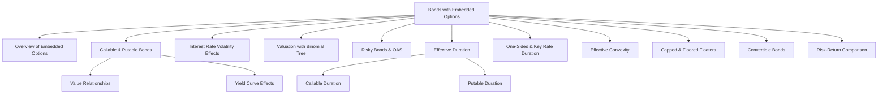

# Module 3: Valuation and Analysis of Bonds with Embedded Options

> [!info] CFA Level 2 — Fixed Income
> **Reading**: [[Valuation|Valuation]] and Analysis of Bonds with [[Embedded options|Embedded Options]]
> **Authors**: Leslie Abreo, MFE; Ioannis Georgiou, CFA; Andrew Kalotay, PhD
> **Lessons**: 1–11 | **LOS Count**: 17

---

## Map of Contents

---

## Lesson 1: Overview of Embedded Options

### What Are Embedded Options?

[[Embedded options]] are contingency provisions in a bond's [[Indenture|indenture]] that give either the issuer or the bondholder the right to take specific actions based on [[Interest rate|interest rate]] movements. They are called "embedded" because they can't be separated and traded independently from the bond.

Every bond with an [[Embedded option|embedded option]] has an [[Underlying|underlying]] [[Straight bond]] (also called the option-free bond) — the same bond without the option feature.

### Types of Embedded Options

**Issuer Options (benefit the issuer)**:
- **[[Call option]]**: The issuer can redeem the bond early, typically when rates have fallen, to refinance at a lower cost
- **[[Prepayment option]]**: Borrowers in securitized pools (e.g., [[Mortgages|mortgages]]) can pay off their loans early

**Investor Options (benefit the bondholder)**:
- **[[Put option]]**: The bondholder can sell the bond back to the issuer at par, typically when rates have risen
- **[[Conversion option]]**: The bondholder can convert the bond into the issuer's [[Common stock|common stock]]
- **[[Extension option]]**: The bondholder can extend the bond's maturity

**Automatic/Complex Options**:
- **[[Cap]]**: Limits the maximum [[Coupon rate|coupon rate]] on a floating-rate bond (issuer option)
- **[[Floor]]**: Sets a minimum [[Coupon rate|coupon rate]] on a floating-rate bond (investor option)
- **[[Estate put]] (survivor's option)**: The bond can be put at par by heirs upon the holder's death

### Exercise Styles

| Style | When Exercisable | Most Common For |
|---|---|---|
| **[[American]]** | Any time after the [[Lockout period|lockout period]] | Callable bonds |
| **[[European]]** | Only on a single specific date | [[Putable bonds|Putable bonds]] |
| **[[Bermudan]]** | On specific preset dates | Some callable/[[Putable bonds|putable bonds]] |

---

## Lesson 2: Callable and Putable Bonds

### Value Relationships

The fundamental pricing relationships link the values of the [[Straight bond|straight bond]], the bond with the [[Embedded option|embedded option]], and the option itself:

**For a [[Callable bond|callable bond]]**:

$$V_{\text{callable}} = V_{\text{straight}} - V_{\text{call option}}$$

> [!note] Why Subtract?
> The [[Call option|call option]] benefits the *issuer*, not the bondholder. The bondholder is effectively *selling* a [[Call option|call option]] to the issuer. The bondholder gives up potential price appreciation in exchange for a higher coupon. Therefore, the [[Callable bond|callable bond]] is worth *less* than the [[Straight bond|straight bond]].

**For a [[Putable bond|putable bond]]**:

$$V_{\text{putable}} = V_{\text{straight}} + V_{\text{put option}}$$

> [!note] Why Add?
> The [[Put option|put option]] benefits the *bondholder*. Having the right to sell the bond back at par provides downside protection. Therefore, the [[Putable bond|putable bond]] is worth *more* than the [[Straight bond|straight bond]].

> [!example] Real-World Analogy
> A [[Callable bond|callable bond]] is like renting an apartment where the landlord can terminate your lease early if they find a higher-paying tenant. You'd demand lower rent (higher yield) for accepting that risk. A [[Putable bond|putable bond]] is like renting with a clause that lets *you* break the lease — you'd be willing to pay slightly more rent for that flexibility.

### Valuation Without Interest Rate Volatility

When rates have **zero [[Volatility|volatility]]** (i.e., we just use the forward rates with certainty):

- **Call value is minimal**: The bond is only called if rates fall below the coupon, but with no [[Volatility|volatility]], rates follow the [[Forward curve|forward curve]] exactly
- **Put value is minimal**: The bond is only put if rates rise above the coupon
- The callable/putable values are very close to the [[Straight bond|straight bond]] value

### Level and Shape of the Yield Curve

**For callable bonds**:
- **Upward-sloping curve** → [[Call option|call option]] is **less valuable** (future rates are expected to be higher, so the issuer is less likely to call)
- **Downward-sloping curve** → [[Call option|call option]] is **more valuable** (rates expected to fall, making refinancing attractive)
- As the curve **flattens at a high level**, the call option goes further **[[Out of the money|out of the money]]**

**For [[Putable bonds|putable bonds]]**:
- **Upward-sloping curve** → [[Put option|put option]] is **more valuable** (rates expected to rise, increasing the chance the investor wants to put)
- **Downward-sloping curve** → [[Put option|put option]] is **less valuable** (rates expected to fall, so the bond's price is likely to remain high)

---

## Lesson 3: Effect of Interest Rate Volatility

### The Key Principle

> [!important]
> **Higher [[Interest rate|interest rate]] [[Volatility|volatility]] increases the value of ALL options** — both calls and puts. This is a fundamental principle from option pricing theory.

Why? Greater [[Volatility|volatility]] means rates are more likely to move significantly in either direction. For a call option, there's a higher chance rates fall enough to make calling profitable. For a [[Put option|put option]], there's a higher chance rates rise enough to make putting attractive. The option holder benefits from extreme moves and is protected from the opposite extreme.

**Impact on bond values**:

| When Volatility ↑ | Call Value | Put Value | [[Callable bond|Callable Bond]] Value | [[Putable bond|Putable Bond]] Value |
|---|---|---|---|---|
| Effect | ↑ | ↑ | ↓ | ↑ |

- $V_{\text{callable}} = V_{\text{straight}} - V_{\text{call}}$ → if call value ↑, callable bond value ↓
- $V_{\text{putable}} = V_{\text{straight}} + V_{\text{put}}$ → if put value ↑, putable bond value ↑

---

## Lesson 4: Valuing Callable and Putable Bonds with a Binomial Tree

### Callable Bond Valuation

The process uses the same [[Backward Induction]] method from [[Module 2 - Arbitrage-Free Valuation Framework|Module 2]], with one additional step: **at each node, check whether the issuer would exercise the call option**.

At each node:
1. Calculate the bond value using [[Backward Induction|backward induction]]: $V = \frac{C + 0.5V_H + 0.5V_L}{1+i}$
2. Compare this value to the **call price** (typically par = 100)
3. The bond value at the node is: $\min(V_{\text{calculated}}, V_{\text{call price}})$

If the calculated value exceeds the call price, the issuer calls the bond — the bondholder receives only the call price, not the higher theoretical value.

### Putable Bond Valuation

Same [[Backward Induction|backward induction]], but now the **bondholder** decides:

At each node:
1. Calculate the bond value
2. Compare to the **put price** (typically par = 100)
3. The bond value at the node is: $\max(V_{\text{calculated}}, V_{\text{put price}})$

If the calculated value falls below the put price, the bondholder puts the bond — they receive the put price instead of accepting the lower [[Market value|market value]].

> [!tip] Memory Trick
> **Callable**: issuer wants low values → use $\min$ (cap the upside)
> **Putable**: investor wants high values → use $\max$ (floor the downside)

---

## Lesson 5: Risky Callable and Putable Bonds — OAS

### Option-Adjusted Spread (OAS)

For corporate (risky) bonds, the market price is below the [[Arbitrage|arbitrage]]-free value from a risk-free tree. The [[CFA_Glossary/Option-adjusted spread]] (OAS) is the **constant spread** added to every rate in the tree so that the model value equals the market price.

> [!example] Real-World Analogy
> Imagine you're calibrating a bathroom scale. The OAS is like the adjustment you make so the scale reads correctly. It's the extra yield (over the risk-free rate) that compensates investors for the bond's [[Credit risk|credit risk]] and [[Liquidity|liquidity]]ty risk|[[Liquidity|liquidity]] risk]], **after removing the effect of the [[Embedded option|embedded option]]**.

**How to compute OAS**:
1. Start with a risk-free [[Binomial tree|binomial tree]] (calibrated to the [[Benchmark|benchmark]] curve)
2. Add a trial spread to every node in the tree
3. Value the bond using [[Backward Induction|backward induction]] with the call/put rules
4. Iterate until the model value equals the market price
5. That spread is the OAS

**Interpreting OAS**:
- A bond is **undervalued** (cheap) if its OAS is higher than OAS on comparable bonds
- A bond is **overvalued** (rich) if its OAS is lower
- OAS strips out the option effect, giving a clean measure of credit compensation

### Effect of Volatility on OAS

| Bond Type | When Assumed Volatility ↑ | OAS Effect |
|---|---|---|
| **Callable** | Call option value ↑ → model value ↓ → need **less** spread to match market price | OAS **decreases** |
| **Putable** | Put option value ↑ → model value ↑ → need **more** spread to match market price | OAS **increases** |
| **Option-free** | No [[Embedded option|embedded option]] → OAS unaffected | **No change** |

> [!warning] This Is Counterintuitive
> For callable bonds, using a higher volatility assumption makes the OAS *shrink*. This doesn't mean the bond became less risky — it means you're attributing more of the yield spread to the option cost and less to [[Credit risk|credit risk]]. The **total yield spread** remains the same; only the decomposition changes.

---

## Lesson 6: Effective Duration

### Why Effective Duration?

[[Modified duration]] assumes cash flows don't change when yields change — fine for option-free bonds, but wrong for bonds with [[Embedded options|embedded options]] (where the option exercise decision changes with rates). [[CFA_Glossary/Effective duration]] measures sensitivity to a *[[Parallel shift|parallel shift]]* of the [[Benchmark|benchmark]] curve and properly accounts for changing cash flows.

$$\text{EffDur} = \frac{PV_{-} - PV_{+}}{2 \times \Delta\text{Curve} \times PV_0}$$

Where:
- $PV_{-}$ = bond price when the [[Benchmark|benchmark]] curve shifts down by $\Delta\text{Curve}$
- $PV_{+}$ = bond price when the [[Benchmark|benchmark]] curve shifts up by $\Delta\text{Curve}$
- $PV_0$ = current bond price
- $\Delta\text{Curve}$ = size of the [[Parallel shift|parallel shift]] (in decimal, e.g., 0.003 for 30 bps)

### Duration Properties by Bond Type

| Bond Type | [[Effective Duration|Effective Duration]] |
|---|---|
| Cash | 0 |
| [[Zero-coupon bond]] | ≈ Maturity |
| [[Fixed-rate bond]] | < Maturity |
| [[Callable bond]] | ≤ Duration of straight bond |
| [[Putable bond]] | ≤ Duration of straight bond |
| [[Floater]] (MRR flat) | ≈ Time to next reset |

Key relationships:
- The effective duration of a **callable bond shortens when rates fall** (call moves into the money, capping price appreciation)
- The effective duration of a **putable bond shortens when rates rise** (put moves into the money, flooring price depreciation)
- When the option is **deep in the money**, the bond behaves like a shorter-maturity bond maturing on the exercise date

---

## Lesson 7: One-Sided and Key Rate Duration

### One-Sided Durations

For bonds with embedded options, the price response to rate changes is **asymmetric** — the bond reacts differently to rate increases versus decreases of the same magnitude. [[One-sided duration]] captures this:

- **One-sided up-duration**: Sensitivity to rate *increases* only
- **One-sided down-duration**: Sensitivity to rate *decreases* only

| Bond Type | Which Side Is Smaller? | Why? |
|---|---|---|
| **Callable** | Down-duration is lower | Price appreciation capped by call price |
| **Putable** | Up-duration is lower | Price depreciation floored by put price |
| **Option-free** | Both sides approximately equal | Symmetric response |

### Key Rate Durations

[[CFA_Glossary/Key rate duration]] shows how a bond's value responds to shifts at *specific* maturity points rather than a parallel shift of the whole curve.

For a **callable bond**: As the coupon increases (making the call more likely), the key rate duration gradually shifts from the maturity-matched rate to the call-date rate. A deep-in-the-money callable bond behaves like a bond maturing on the call date.

For a **putable bond**: As the coupon decreases (making the put more likely), the key rate duration shifts from the maturity-matched rate to the put-date rate.

---

## Lesson 8: Effective Convexity

### The Formula

[[CFA_Glossary/Effective convexity]] measures how [[CFA_Glossary/Effective duration]] itself changes as rates change:

$$\text{EffCon} = \frac{PV_{-} + PV_{+} - 2 \times PV_0}{(\Delta\text{Curve})^2 \times PV_0}$$

### Convexity by Bond Type

| Bond Type | Convexity Sign | Interpretation |
|---|---|---|
| **Option-free** | Always **positive** | Price gains from rate decreases exceed price losses from equal rate increases |
| **Putable** | Always **positive** | Put option adds to upside protection |
| **Callable** (option near the money) | **Negative** | Price upside is capped; downside is uncapped — the worst of both worlds for the investor |

> [!warning] Negative [[Convexity|Convexity]] Is Bad for Investors
> When a callable bond has negative [[Convexity|convexity]], the bondholder loses more when rates rise than they gain when rates fall by the same amount. The issuer benefits from this asymmetry.

---

## Lesson 9: Capped and Floored Floating-Rate Bonds

### Capped Floaters

A [[Capped floater]] is a floating-rate bond where the coupon cannot exceed a maximum rate (the cap). The cap is an **issuer option** — it protects the issuer from paying extremely high coupons.

$$V_{\text{capped floater}} = V_{\text{straight floater}} - V_{\text{embedded cap}}$$

The cap reduces the bond's value to the investor.

**[[Valuation|Valuation]]**: Use the [[Binomial tree|binomial tree]]. At each node where the floating rate exceeds the cap, the coupon is set to the [[Cap rate|cap rate]] instead of the full floating rate.

### Floored Floaters

A [[Floored floater]] has a minimum [[Coupon rate|coupon rate]] (the floor). The floor is an **investor option** — it guarantees a minimum return.

$$V_{\text{floored floater}} = V_{\text{straight floater}} + V_{\text{embedded floor}}$$

The floor increases the bond's value to the investor.

---

## Lesson 10: Convertible Bonds

### Defining Features

A [[Convertible bond]] gives the bondholder the right to convert the bond into a fixed number of the issuer's [[Common shares|common shares]].

**Key terms**:

| Term | Definition | Formula |
|---|---|---|
| [[Conversion ratio]] | Number of shares per bond | Fixed in the [[Indenture|indenture]] |
| [[Conversion price]] | Implied share price at conversion | $\frac{\text{Par value}}{\text{Conversion ratio}}$ |
| [[Conversion value]] | [[Market value|Market value]] of shares received | $\text{Share price} \times \text{Conversion ratio}$ |
| [[Straight value]] | Value of the bond without conversion | PV of cash flows at appropriate yield |
| [[Minimum value]] | Floor value of the convertible | $\max(\text{Conversion value}, \text{Straight value})$ |
| [[Market conversion price]] | Effective price paid per share | $\frac{\text{Market price of convertible}}{\text{Conversion ratio}}$ |
| [[Market conversion premium per share]] | Premium over current stock price | Market [[Conversion price|conversion price]] − Stock market price |
| [[Market conversion premium ratio]] | Premium as % of stock price | $\frac{\text{Market conversion premium per share}}{\text{Stock market price}}$ |
| [[Premium over straight value]] | How much convertible exceeds straight | $\frac{\text{Market price of convertible}}{\text{Straight value}} - 1$ |

### Convertible Bond Value Components

For a callable, putable [[Convertible bond|convertible bond]]:

$$V_{\text{convertible}} = V_{\text{straight}} + V_{\text{call on stock}} - V_{\text{call on bond}} + V_{\text{put on bond}}$$

The bondholder benefits from the conversion option (+) and put option (+), but loses from the issuer's call option (−).

### Risk-Return Characteristics

The [[Convertible bond|convertible bond]]'s behavior depends on where the stock price is relative to the [[Conversion price|conversion price]]:

| Stock Price vs. [[Conversion price|Conversion Price]] | Convertible Behaves Like... | Dominated By... |
|---|---|---|
| Well **below** (busted convertible) | A straight bond | Bond [[Risk factors|risk factors]] (credit, [[Interest rate|interest rate]]) |
| **Near** the [[Conversion price|conversion price]] | A hybrid | Both bond and equity factors |
| Well **above** | The [[Underlying|underlying]] stock | Equity [[Risk factors|risk factors]] |

> [!tip] The "Best of Both Worlds" Pitch
> Convertibles offer equity upside with bond-like downside protection. But this protection isn't free — investors accept lower yields than comparable straight bonds. The [[Convertible bond|convertible bond]]'s price typically tracks the *maximum* of straight bond value and [[Conversion value|conversion value]], plus a premium for the option.

---

## Key Takeaways

> [!summary]
> - $V_{\text{call}} = V_{\text{straight}} - V_{\text{callable}}$; $V_{\text{put}} = V_{\text{putable}} - V_{\text{straight}}$
> - Higher volatility increases ALL option values → decreases callable bond values, increases putable bond values
> - OAS is the constant spread added to the tree that matches the model value to the market price
> - Higher volatility assumption → lower OAS for callables, higher OAS for putables
> - Callable bonds have negative [[Convexity|convexity]] near the money; [[Putable bonds|putable bonds]] always have positive [[Convexity|convexity]]
> - [[One-Sided Durations|One-sided durations]] better capture asymmetric risk: callables have lower down-duration, putables have lower up-duration
> - [[Convertible Bonds|Convertible bonds]] combine bond characteristics with equity upside through the conversion option

---

## Formula Reference

| Formula | Description |
|---|---|
| $V_{\text{callable}} = V_{\text{straight}} - V_{\text{call}}$ | [[Callable bond]] value |
| $V_{\text{putable}} = V_{\text{straight}} + V_{\text{put}}$ | [[Putable bond]] value |
| $\text{EffDur} = \frac{PV_- - PV_+}{2 \times \Delta\text{Curve} \times PV_0}$ | [[CFA_Glossary/Effective duration]] |
| $\text{EffCon} = \frac{PV_- + PV_+ - 2PV_0}{(\Delta\text{Curve})^2 \times PV_0}$ | [[CFA_Glossary/Effective convexity]] |
| $V_{\text{capped}} = V_{\text{floater}} - V_{\text{cap}}$ | [[Capped floater]] value |
| $V_{\text{floored}} = V_{\text{floater}} + V_{\text{floor}}$ | [[Floored floater]] value |
| $\text{Min value of convertible} = \max(CV, SV)$ | [[Convertible bond]] minimum value |
