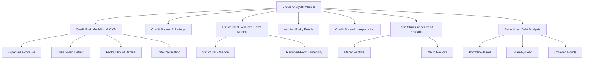

# Module 4: Credit Analysis Models

> [!info] CFA Level 2 — Fixed Income
> **Reading**: [[Credit analysis|Credit Analysis]] Models
> **Authors**: James F. Adams, PhD, CFA & Donald J. Smith, PhD
> **Lessons**: 1–8 | **LOS Count**: 8

---

## Map of Contents

---

## Lesson 1–2: Modeling Credit Risk and the Credit Valuation Adjustment

### The Building Blocks of Credit Risk

[[Credit risk|Credit risk]] boils down to three questions: How much could I lose? How badly? How likely is it?

**1. [[Expected Exposure]] (EE)**

The amount the bondholder stands to lose if default occurs at a given point in time — essentially the bond's projected value (including [[Accrued interest|accrued interest]]) at each potential default date.

> [!example] Real-World Analogy
> If you lend someone \$100 and they've already paid you back \$20, your expected exposure is approximately \$80 plus any [[Accrued interest|accrued interest]] — that's the amount at risk.

**2. [[Recovery rate]] (RR)**

The percentage of the exposure that investors can expect to recover after a default. Depends on the issuer's assets, seniority of the debt, and legal jurisdiction.

$$\text{Loss Given Default (LGD)} = (1 - \text{Recovery Rate}) \times \text{Expected Exposure}$$

Or equivalently in percentage terms: $\text{LGD\%} = 100\% - \text{Recovery Rate}$

**3. [[CFA_Glossary/Probability of default]] (POD)**

The [[Likelihood|likelihood]] of default in a given period. In credit models, we use the [[CFA_Glossary/Hazard rate]] — the **conditional** [[Probability|probability]]ty of Default|[[Probability|probability]] of default]] in a period, given that default hasn't occurred in prior periods.

Key relationship for survival:

$$\text{Probability of survival through period } t = \prod_{i=1}^{t}(1 - \text{POD}_i)$$

Where $\text{POD}_i$ is the [[Conditional probability|conditional probability]] of default in period $i$.

> [!note] Why "Conditional"?
> The [[Hazard Rate|hazard rate]] isn't just "[[Probability of Default|probability of default]] in Year 3." It's "[[Probability|probability]]ty of Default|[[Probability|probability]] of default]] in Year 3, *given that the company survived Years 1 and 2*." Each period's POD is calculated from the [[Hazard Rate|hazard rate]] applied to the surviving [[Population|population]]. If the [[Hazard Rate|hazard rate]] is constant at 1.25%, the POD for Year 2 is $1.25\% \times (1 - 1.25\%) = 1.2344\%$ — slightly lower because there's a small chance default already happened in Year 1.

**4. [[CFA_Glossary/Expected loss]] (EL)**

$$\text{Expected Loss} = \text{POD} \times \text{LGD}$$

This is the probability-weighted loss — the "average" loss considering that default may or may not occur.

### The Credit Valuation Adjustment (CVA)

The [[CVA]] is the present value of all expected losses over the life of the bond:

$$\text{CVA} = \sum_{t=1}^{T} \text{PV}(\text{Expected Loss}_t)$$

Each period's [[Expected Loss|expected loss]] is discounted back to today at the risk-free rate.

**The [[Fair value|fair value]] of a risky bond**:

$$V_{\text{risky bond}} = V_{\text{risk-free bond}} - \text{CVA}$$

> [!note] What CVA Is Really Saying
> CVA quantifies the "cost" of [[Credit risk|credit risk]]. It's the dollar amount an investor should deduct from the hypothetical default-free value to arrive at a fair price that compensates for the possibility of default. The higher the CVA, the riskier the bond.

### Worked Example: CVA Calculation

**Setup**: 5-year, 3.50% coupon bond, priced at par (100). [[Recovery rate|Recovery rate]] = 70%. Annual [[Hazard Rate|hazard rate]] = 1.25%. Government bond yields provide the discount factors.

| Date | Expected Exposure | LGD (70% recovery) | POD | [[Expected Loss|Expected Loss]] | [[Discount factor|Discount Factor]] | PV of [[Expected Loss|Expected Loss]] |
|---|---|---|---|---|---|---|
| 1 | 103.29 | 72.30 | 1.2500% | 0.9038 | 1.002506 | 0.9060 |
| 2 | 101.55 | 71.08 | 1.2344% | 0.8775 | 0.985093 | 0.8644 |
| 3 | 101.04 | 70.73 | 1.2189% | 0.8622 | 0.955848 | 0.8241 |
| 4 | 102.09 | 71.47 | 1.2037% | 0.8601 | 0.913225 | 0.7856 |
| 5 | 103.50 | 72.45 | 1.1887% | 0.8613 | 0.870016 | 0.7492 |
| **Total** | | | **6.0957%** | | **CVA =** | **4.1293** |

**Step-by-step walkthrough for Date 2**:

1. **Expected Exposure** = 101.55 — the bond's projected value at Date 2 if the issuer is still alive (coupon + PV of remaining cash flows)
2. **LGD** = $101.55 \times (1 - 0.70) = 101.55 \times 0.30 = 30.47$... wait, that doesn't match. Let's clarify: the LGD here is calculated as $\text{EE} \times \text{Loss Severity}$. With 70% *[[Loss severity|loss severity]]* (not [[Recovery rate|recovery rate]]), LGD = $101.55 \times 0.70 = 71.08$. Check your source for whether 70% refers to the [[Recovery rate|recovery rate]] or the [[Loss severity|loss severity]] — in the Mark Meldrum formula sheet, LGD% = 100% − [[Recovery rate|recovery rate]]
3. **POD** = Hazard rate × Probability of surviving to Date 1 = $1.25\% \times (1 - 1.25\%) = 1.25\% \times 98.75\% = 1.2344\%$
4. **[[Expected Loss|Expected Loss]]** = $71.08 \times 1.2344\% = 0.8775$
5. **PV of Expected Loss** = $0.8775 \times 0.985093 = 0.8644$

**Final Results**:
- Risk-free bond value (VND, Value assuming No Default) = 103.5450
- CVA = 4.1293
- [[Fair value|Fair value]] of risky bond = $103.5450 - 4.1293 = 99.4157$
- Government bond YTM = 2.7500%
- Risky bond YTM = 3.6299%
- **Credit spread** = $3.6299\% - 2.7500\% = 87.99$ bps

> [!tip] The Big Picture
> The CVA framework gives you the credit spread from first principles. You don't need to observe it in the market — you can *derive* it from assumptions about [[Default probability|default probability]] and recovery. Of course, in practice you compare your derived spread to the [[Market spread|market spread]] to identify [[Mispricing|mispricing]].

---

## Lesson 3: Credit Scores and Credit Ratings

### Credit Scores

[[Credit scores]] are used in **retail lending** ([[Mortgages|mortgages]], credit cards, auto loans). They are ordinal rankings — higher = better creditworthiness. They are based on statistical models using factors like payment history, credit utilization, length of credit history, types of credit, and recent inquiries.

### Credit Ratings

[[CFA_Glossary/Credit ratings]] are used in **wholesale bond markets**. Agencies ([[Moody's]], [[S&P]], [[Fitch]]) assign letter grades (AAA, AA, A, BBB, etc.) reflecting the [[Probability of Default|probability of default]].

> [!note] Scores vs. Ratings
> Both are ordinal (relative rankings), not cardinal (absolute measurements). A credit score of 750 doesn't mean "twice as creditworthy" as 375. Similarly, an A rating doesn't mean "half the [[Default risk|default risk]]" of AA — you need the actual [[Default probability|default probability]] data to make that comparison.

### Credit Migration and Expected Return

Ratings change over time. A [[transition matrix]] shows the probability of moving between ratings over one year:

| From \ To | AAA | AA | A | BBB | BB | B | CCC | D |
|---|---|---|---|---|---|---|---|---|
| **AA** | 1.50% | 88.00% | 9.50% | 0.75% | 0.15% | 0.05% | 0.03% | 0.02% |

To estimate the **expected return impact** of credit migration:

1. For each possible transition, calculate the price change using duration:

$$\Delta P \approx -\text{Modified Duration} \times \Delta\text{Spread}$$

2. Weight each price change by its transition probability
3. Sum the weighted changes

### Worked Example: Expected Return from Credit Migration

**Given**: An AA-rated bond with [[Modified duration|modified duration]] = 2.75. Current AA spread = 0.90%.

**For each possible transition**:

| Transition | New Spread | ΔSpread | ΔPrice | Probability | Weighted ΔP |
|---|---|---|---|---|---|
| AA → AAA | 0.60% | −0.30% | +0.83% | 1.50% | +0.0124% |
| AA → AA | 0.90% | 0% | 0% | 88.00% | 0% |
| AA → A | 1.10% | +0.20% | −0.55% | 9.50% | −0.0523% |
| AA → BBB | 1.50% | +0.60% | −1.65% | 0.75% | −0.0124% |
| AA → BB | 3.40% | +2.50% | −6.88% | 0.15% | −0.0103% |
| AA → B | 6.50% | +5.60% | −15.40% | 0.05% | −0.0077% |
| AA → CCC | 9.50% | +8.60% | −23.65% | 0.03% | −0.0071% |

**Sum** = −0.0774%

**Expected return** ≈ YTM − 0.0774% (assuming no default)

> [!warning] Credit Migration Typically Reduces Expected Return
> Notice the adjustment is *negative*. This is because downgrades (which are more damaging, given the larger spread changes) are more probable than upgrades of equal magnitude. The downgrade to BB causes −6.88% price change versus only +0.83% for an upgrade to AAA, and the downgrade probabilities (though small) dominate.

---

## Lesson 4: Structural and Reduced-Form Credit Models

### Structural Models (Black-Scholes-Merton, 1974)

[[CFA_Glossary/Structural models]] are based on the option pricing framework:

**Core insight**: A company defaults when the value of its **assets falls below its [[Liabilities|liabilities]]** (the [[default barrier]]).

> [!example] Real-World Analogy
> Imagine a homeowner with a \$300,000 mortgage on a house worth \$400,000. They have \$100,000 of "equity." If house prices fall to \$250,000, the house is worth less than the mortgage — the homeowner is "underwater" and might choose to default (walk away). The "default barrier" is the mortgage balance, and the "asset value" is the house value.

**Options interpretation**:
- **Equity = [[Call option]] on the company's assets** with a strike price equal to the [[Face value|face value]] of debt. Shareholders benefit from upside and have limited downside (they can walk away in [[Bankruptcy|bankruptcy]], losing only their equity).
- **Risky debt = Risk-free debt − [[Put option]] on the company's assets**. Bondholders effectively sold a put to shareholders — if asset value drops below the debt value, shareholders "put" the company to the bondholders.

**The probability of default** is the area of the asset value [[Probability distribution|probability distribution]] that falls below the default barrier. It increases with:
- Higher asset [[Volatility|volatility]] (wider distribution)
- Higher leverage (default barrier moves up)
- Longer time horizon (more time for bad outcomes)

**Strengths**:
- Provides economic intuition for *why* default occurs
- Links [[Credit risk|credit risk]] to observable option pricing concepts
- Explains the relationship between equity [[Volatility|volatility]] and [[Credit risk|credit risk]]

**Weaknesses**:
- Asset values don't trade directly — hard to observe in practice
- Companies can hide debt (Enron, Lehman Brothers), making the default barrier unreliable
- Assumes a simple [[Capital structure|capital structure]] (one class of debt, one maturity)
- Requires "inside" information that's best known to company management

### Reduced-Form Models (Jarrow-Turnbull, 1995; Duffie-Singleton, 1999)

[[Reduced-form models]] don't try to explain *why* default occurs — they statistically model *when* it occurs.

**Core mechanism**: Default is modeled as a random event using a [[Poisson process]] with a [[Default intensity]] (hazard rate) that varies over time. The [[Default intensity|default intensity]] is estimated using regression analysis on:

- **Firm-specific variables**: Leverage ratio, net-income-to-assets, cash-to-assets
- **Macroeconomic variables**: [[Unemployment rate|Unemployment rate]], GDP growth, stock market [[Volatility|volatility]]

**Strengths**:
- Uses publicly available, observable data (no "inside" information needed)
- Can incorporate [[Business cycle|business cycle]] effects through macro variables
- Flexible — [[Default intensity|default intensity]] can vary with market conditions

**Weaknesses**:
- Default comes as a "surprise" in the model — in reality, companies are usually downgraded several times before default (RadioShack was downgraded repeatedly before its eventual default)
- No structural economic explanation for *why* default happens
- Statistical, not causal

### Comparison Table

| Feature | Structural | Reduced-Form |
|---|---|---|
| Explains *why* default occurs | ✅ (assets < liabilities) | ❌ (just estimates *when*) |
| Uses publicly available data | ❌ (needs asset value, volatility) | ✅ (financial ratios, macro data) |
| Uses option pricing | ✅ | ❌ (uses regression/hazard rates) |
| Handles complex capital structures | ❌ (struggles) | ✅ |
| Default is endogenous (internal) | ✅ | ❌ (exogenous, random "surprise") |
| Developed | 1970s (Black-Scholes-Merton) | 1990s (Jarrow-Turnbull, Duffie-Singleton) |

---

## Lesson 5: Valuing Risky Bonds in an Arbitrage-Free Framework

Using the [[Binomial tree]] from [[Module 2 - Arbitrage-Free Valuation Framework|Module 2]], risky bonds are valued by incorporating credit risk:

1. Build and calibrate a risk-free binomial tree
2. At each node, compute expected losses using POD, LGD, and recovery assumptions
3. Subtract the CVA from the risk-free value to get the fair value
4. The credit spread is the difference in yields

The [[credit spread]] is then:

$$\text{Credit Spread} = \text{YTM}_{\text{risky}} - \text{YTM}_{\text{risk-free}}$$

### Floating-Rate Notes

For floating-rate notes, the analogous concept is the [[Discount margin]] — the spread over the reference rate that makes the FRN's present value equal to its market price. The discount margin can also be calculated within the arbitrage-free framework.

---

## Lesson 6: Interpreting Changes in Credit Spreads

### Sensitivity of Credit Spreads

Changes in credit spreads can be decomposed into the effects of changing individual risk parameters:

| Parameter Change | Effect on Credit Spread |
|---|---|
| **POD increases** | Spread **widens** (more expected losses) |
| **Recovery rate decreases** | Spread **widens** (larger losses given default) |
| **Expected exposure increases** | Spread **widens** (more at risk) |

> [!tip] Practical Application
> If an analyst believes the market is overestimating a company's [[Default probability|default probability]], the credit spread is "too wide" relative to [[Fundamentals|fundamentals]]. The bond is undervalued — buy it to earn the excess spread as it normalizes.

---

## Lesson 7: The Term Structure of Credit Spreads

### What Shapes the Credit Spread Curve?

The [[credit spread term structure]] shows how [[Credit spreads|credit spreads]] vary across maturities for a given issuer or rating category.

**Macro factors**:
- **Weak economy** → [[Credit spreads|credit spreads]] **widen** and the [[Spread curve|spread curve]] **steepens** (long-term [[Default risk|default risk]] increases more than short-term)
- **Strong economy** → spreads **narrow** and the curve flattens
- Supply/demand dynamics — frequently traded maturities influence the curve shape most

**Micro (issuer-specific) factors**:
- Events that could **reduce leverage** (asset sales, equity issuance) can cause the [[Spread curve|spread curve]] to **flatten or invert** — near-term risk remains but long-term outlook improves
- **High near-term [[Default probability|default probability]]** → **inverted** credit [[Spread curve|spread curve]] (short-term spreads exceed long-term)

**Key observation**: When a bond is very likely to default soon, it trades near its **recovery value** at all maturities, and the credit [[Spread curve|spread curve]] becomes less informative.

> [!example] Inverted Credit Spread Curve
> A distressed company might have a 1-year spread of 1,700 bps but a 10-year spread of only 660 bps. The interpretation: there's enormous near-term risk, but *if* the company survives, its long-term prospects are somewhat better. The 1-year bond trades close to expected recovery value.

**Empirical evidence**: For [[investment-grade]] bonds, the credit spread curve is typically **upward sloping** — reflecting greater uncertainty about creditworthiness over longer horizons.

---

## Lesson 8: Credit Analysis for Securitized Debt

### How Is It Different from Corporate Credit Analysis?

[[Securitized debt]] ([[ABS]], [[MBS]], [[CLOs]]) requires a fundamentally different [[Credit analysis|credit analysis]] compared to corporate bonds because:

1. **The collateral matters more than the issuer**: Credit quality depends on the [[Underlying|underlying]] asset pool ([[Mortgages|mortgages]], auto loans, credit card receivables), not a corporate [[Balance sheet|balance sheet]]
2. **Structural features**: [[Tranching]], credit enhancement ([[Overcollateralization]], [[Subordination]]), and [[waterfall]] structures determine how losses are distributed among investors
3. **[[Servicer risk]]**: The entity collecting payments from borrowers could fail or perform poorly, disrupting cash flows even when [[Underlying|underlying]] borrowers are paying

### Analytical Approaches

| Portfolio Type | Best Approach | Example | Why |
|---|---|---|---|
| **Granular, homogeneous** | **Portfolio-based** (statistical) | Credit card ABS, auto loan ABS | Many small, similar loans — individual analysis impractical; statistical models work well |
| **Concentrated, heterogeneous** | **Loan-by-loan** | CLOs, commercial MBS | Fewer, larger loans with distinct characteristics requiring individual assessment |

> [!warning] Static vs. Dynamic Pools
> A statistics-based approach works for **static** pools (the loans are fixed at issuance). For **dynamic** pools (like revolving credit card receivables where new balances constantly enter), the portfolio-based approach must account for the changing composition.

### Covered Bonds

[[Covered bonds]] are a special type of secured bond common in Europe, backed by a **cover pool** (usually [[Mortgages|mortgages]] or public-sector loans) that remains on the issuer's [[Balance sheet|balance sheet]]. They offer **dual recourse** — if the issuer defaults, investors have recourse to both the issuer and the cover pool. This leads to high recovery rates and ratings often several notches above the issuer's own rating.

**Redemption types in default**:
- **Hard-bullet**: If payments aren't made on time, bond default is triggered immediately
- **Soft-bullet**: Default and acceleration delayed up to ~1 year past original maturity
- **Conditional pass-through**: Converts to pass-through securities after original maturity

---

## Key Takeaways

> [!summary]
> - CVA = PV of expected losses = risk-free value − [[Fair value|fair value]] of risky bond
> - Hazard rates drive conditional default probabilities period by period
> - Expected loss = POD × LGD for each period; CVA sums the PVs
> - Credit migration typically reduces expected return (downgrades hurt more than upgrades help)
> - [[Structural Models|Structural models]] explain *why* default occurs (assets < liabilities); reduced-form models predict *when* (statistically)
> - Credit spread curves are upward sloping for investment grade, can invert for distressed issuers
> - Securitized debt analysis focuses on collateral quality, structural features, and servicer risk rather than issuer balance sheets
> - Granular/homogeneous pools → portfolio-based analysis; concentrated/heterogeneous → loan-by-loan

---

## Formula Reference

| Formula | Description |
|---|---|
| $\text{CVA} = \sum_{t=1}^{T} PV(\text{EL}_t)$ | [[Credit Valuation Adjustment]] |
| $V_{\text{risky}} = V_{\text{risk-free}} - \text{CVA}$ | [[Fair value|Fair value]] of risky bond |
| $\text{EL} = \text{POD} \times \text{LGD}$ | [[CFA_Glossary/Expected loss]] |
| $\text{LGD} = (1 - \text{RR}) \times \text{EE}$ | [[CFA_Glossary/Loss given default]] |
| $P(\text{survival to } t) = \prod_{i=1}^{t}(1 - \text{POD}_i)$ | Cumulative [[Survival probability|survival probability]] |
| $\Delta P \approx -\text{ModDur} \times \Delta\text{Spread}$ | Price change from [[credit migration]] |
| $\text{Credit Spread} = \text{YTM}_{\text{risky}} - \text{YTM}_{\text{risk-free}}$ | [[Credit spread]] |
