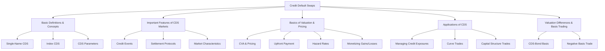

# Module 5: Credit Default Swaps

> [!info] CFA Level 2 — Fixed Income
> **Reading**: Credit Default Swaps
> **Authors**: Brian Rose & Don M. Chance, PhD, CFA
> **Lessons**: 1–6 | **LOS Count**: 5

---

## Map of Contents

---

## Lesson 1–2: Basic Definitions and Concepts

### What Is a CDS?

A [[CFA_Glossary/Credit default swap]] (CDS) is a [[Derivative|derivative]] contract where:
- The **[[protection buyer]]** makes periodic payments (the [[CDS spread]] or premium) to the protection seller
- The **[[protection seller]]** promises to compensate the buyer if a [[Credit event]] occurs on the [[Reference entity]]

> [!example] Real-World Analogy
> A CDS is like an insurance policy on a bond. You pay regular premiums, and if the "insured event" (default) occurs, the insurer pays you. The key difference: you don't need to own the bond to buy CDS protection — it's like buying fire insurance on your neighbor's house. This makes CDS useful for speculation, not just hedging.

### Key Terminology

| Term | Definition |
|---|---|
| [[Reference entity]] | The borrower whose credit quality is being protected (e.g., Ford Motor Company) |
| [[Reference obligation]] | The specific debt instrument, usually a senior unsecured bond |
| [[Notional amount]] | The [[Face value|face value]] of protection — determines the size of payouts |
| [[Protection buyer]] | Pays the premium; is **"short" the credit** — profits when credit deteriorates |
| [[Protection seller]] | Receives the premium; is **"long" the credit** — profits when credit improves or stays stable |
| [[CDS spread]] | Annual premium paid by the buyer, quoted in basis points of the notional |

> [!warning] Long vs. Short Terminology
> This can be confusing. The protection **buyer** is *short* credit (betting on deterioration). The protection **seller** is *long* credit (betting on stability/improvement). Think of it like short-selling a stock: the short-seller profits when the price falls.

### Why Do CDS Exist?

Beyond hedging [[Credit risk|credit risk]], investors use CDS to:
- **Leverage portfolios** — CDS require less capital than buying bonds outright
- **Access specific maturity exposures** not available in the cash bond market
- **Isolate [[Credit risk|credit risk]]** from [[Interest rate|interest rate]]te risk|[[Interest rate|interest rate]] risk]] (a bond's price moves with both; a CDS responds primarily to credit)
- **Improve [[Liquidity|liquidity]]** — CDS can be more liquid than the [[Underlying|underlying]] bonds, especially during stress
- **Enable [[Price discovery|price discovery]]** — CDS spreads reveal the market's real-time assessment of [[Credit risk|credit risk]]

---

## Lesson 3: Important Features of CDS Markets

### Credit Events

The [[ISDA]] (International Swaps and [[Derivatives|Derivatives]] Association) [[Determinations Committee]] decides whether a [[Credit event|credit event]] has occurred. This committee prevents disputes by providing a standardized ruling that applies to all CDS contracts on the same [[Reference entity|reference entity]].

**Common credit events**:

| Event | Description | Example |
|---|---|---|
| **[[Bankruptcy]]** | Formal legal insolvency proceeding | Lehman Brothers (2008) |
| **[[Failure to pay]]** | Missing a scheduled interest or [[Principal|principal]] payment beyond any grace period | Argentina sovereign default (2001) |
| **[[Restructuring]]** | Forced changes to debt terms unfavorable to creditors (maturity extension, coupon reduction, currency change) | Greece (2012) — controversial; not always included in CDS contracts |
| **Moratorium/Repudiation** | Government entity suspends or refuses to honor debt obligations | Applicable mainly to sovereign CDS |

> [!note] [[Restructuring|Restructuring]] Is Controversial
> [[Restructuring|Restructuring]] is included in European CDS contracts but often excluded from North American contracts. The disagreement centers on whether a "voluntary" [[Restructuring|restructuring]] (where bondholders agree to modified terms) should trigger CDS payouts.

### Settlement Protocols

When a [[Credit event|credit event]] is confirmed:

**[[Physical settlement]]**: The protection buyer delivers the defaulted bond to the seller and receives the full [[Notional amount|notional amount]] in cash. The buyer is "made whole."

**[[Cash settlement]]** (more common today): An ISDA-administered **auction** determines the [[Recovery rate|recovery rate]] of the defaulted bonds. The protection seller pays:

$$\text{Payout} = \text{Notional} \times (1 - \text{Recovery Rate from Auction})$$

> [!example] [[Cash settlement|Cash Settlement]]nt|Settlement]] Example
> You bought \$10 million of CDS protection. The [[Reference entity|reference entity]] defaults, and the auction determines a [[Recovery rate|recovery rate]] of 35%. The protection seller pays you:
> $\$10\text{M} \times (1 - 0.35) = \$6.5\text{M}$

**[[Cheapest-to-deliver]] (CTD) option**: In [[Physical settlement|physical settlement]], the protection buyer can deliver any qualifying obligation of the [[Reference entity|reference entity]]. They'll deliver the *cheapest* one, maximizing their payout. This CTD option has value and slightly increases CDS spreads relative to a specific bond's spread.

### Index CDS

An [[Index CDS]] provides protection on a portfolio of reference entities. Think of it as a diversified "basket" of [[Single-name CDS|single-name CDS]] contracts bundled together.

**Major indexes**:

| Index | Region | Composition |
|---|---|---|
| **[[CDX IG]]** | North America | 125 investment-grade names |
| **[[CDX HY]]** | North America | 100 high-yield names |
| **[[iTraxx Main]]** | Europe | 125 investment-grade names |
| **[[iTraxx Crossover]]** | Europe | High-yield names |

**Key features**:
- **Equally weighted** — each name has the same notional proportion (e.g., \$4M each in a \$500M CDX IG trade)
- **When an entity defaults**, it's removed from the index and settled individually as a [[Single-name CDS|single-name CDS]]. The index continues with a smaller notional.
- **Updated every 6 months** — moving from an old series to a new one is called a [[Roll]]

> [!tip] [[Index CDS|Index CDS]] Are More Liquid Than [[Single-name CDS|Single-Name CDS]]
> Because indexes represent standardized, diversified credit exposure, they trade in much larger volumes than any individual [[Single-name CDS|single-name CDS]]. This makes them the preferred tool for expressing broad credit market views.

> [!example] [[Index CDS|Index CDS]] Hedging
> An investor sells \$500M of protection on CDX IG (125 names, so \$4M exposure per name). Worried about Company A, they buy \$3M of single-name protection on Company A. If Company A defaults:
> - **Index exposure**: \$4M (long credit, loses)
> - **Single-name hedge**: \$3M (short credit, gains)
> - **Net exposure**: \$1M (75% hedged)
> - **Remaining index notional**: \$496M (\$500M − \$4M removed)

### Market Characteristics

CDS trade in the **over-the-counter (OTC)** market. The market originated in the 1990s when banks sought to transfer [[Credit risk|credit risk]] without selling loans (which would damage client relationships). Today, CDS serve as a critical tool for credit [[Risk transfer|risk transfer]], [[Price discovery|price discovery]], and speculative positioning across the global financial system.

---

## Lesson 4: Basics of Valuation and Pricing

### CDS Pricing from CVA

The [[CDS spread|CDS spread]] should approximate the credit spread implied by the [[CVA]] framework covered in [[Module 4 - Credit Analysis Models|Module 4]]:

| Leg | Description |
|---|---|
| **[[Protection leg]]** | PV of payments from seller to buyer if default occurs = PV of expected losses |
| **[[Premium leg]]** | PV of periodic spread payments from buyer to seller |

At initiation, the [[CDS spread|CDS spread]] is set so that:

$$\text{PV(Protection leg)} = \text{PV(Premium leg)}$$

The [[CDS spread|CDS spread]] is the premium rate that equates these two present values — analogous to finding the "fair" insurance premium.

### The Hazard Rate and Default Probability

The [[CFA_Glossary/Hazard rate]] is the [[Conditional probability|conditional probability]]ty|probability]]ty of Default|[[Probability|probability]] of default]] in the next period, given survival to that point. From the [[Hazard Rate|hazard rate]], we can derive:

$$\text{POD}_t = \text{Hazard Rate} \times \text{Probability of Survival to } t-1$$

**[[CDS spread|CDS spread]] determinants**:
- **Higher [[Probability of Default|probability of default]]** → higher CDS spread
- **Higher [[Loss Given Default|loss given default]]** → higher CDS spread

### The Credit Curve

The [[Credit curve]] shows CDS spreads across different maturities for a given [[Reference entity|reference entity]]. It's analogous to the [[Yield curve|yield curve]] but for credit risk:

- **Upward-sloping [[Credit curve|credit curve]]** (normal): Credit risk increases with time horizon — the most common shape for investment-grade names
- **Flat [[Credit curve|credit curve]]**: Credit risk is roughly constant across maturities
- **Inverted [[Credit curve|credit curve]]**: Near-term credit risk exceeds long-term — typical for distressed or speculative-grade names facing imminent difficulties

### CDS Pricing Conventions

Standardized CDS contracts trade with **fixed coupons** to improve [[Liquidity|liquidity]]:
- **Investment grade**: Fixed coupon of **100 bps**
- **[[High yield|High yield]]**: Fixed coupon of **500 bps**

When the market CDS spread differs from the fixed coupon, the difference is settled through an [[Upfront payment]]:

$$\text{Upfront Payment} \approx (\text{CDS Spread} - \text{Fixed Coupon}) \times \text{Duration} \times \text{Notional Principal}$$

> [!example] [[Upfront payment|Upfront Payment]] Calculation
> A CDS has a [[Market spread|market spread]] of 250 bps, a fixed coupon of 100 bps, a duration of 4 years, and a notional of \$10M.
>
> $\text{Upfront} \approx (0.0250 - 0.0100) \times 4 \times \$10\text{M} = \$600,000$
>
> The protection **buyer** pays \$600,000 upfront because the [[Market spread|market spread]] (250 bps) exceeds the fixed coupon (100 bps) — they're getting below-market ongoing payments, so they compensate with an upfront lump sum.

- If CDS spread **>** fixed coupon → **buyer** makes the [[Upfront payment|upfront payment]]
- If CDS spread **<** fixed coupon → **seller** makes the upfront payment

### Valuation Changes During the CDS Life

After initiation, as credit conditions change, the CDS gains or loses value:

$$\text{Profit for protection buyer} \approx \Delta\text{Spread} \times \text{Duration} \times \text{Notional Principal}$$

> [!example] [[Monetizing|Monetizing]] a CDS Position
> You bought protection at a CDS spread of 200 bps. Spreads widen to 350 bps. Duration = 5 years. Notional = \$10M.
>
> $\text{Profit} \approx (350 - 200) \times 0.0001 \times 5 \times \$10\text{M} = \$750,000$
>
> You can close out the position by selling protection at the new wider spread, locking in this gain.

If spreads **widen** (credit deteriorates): protection buyer profits, seller loses.
If spreads **narrow** (credit improves): protection seller profits, buyer loses.

---

## Lesson 5: Applications of CDS

### Managing Credit Exposures

**Hedging a bond position**: A bondholder worried about an issuer's credit quality can buy CDS protection. If the issuer defaults, the CDS payout offsets the bond's loss. If no default occurs, the bondholder loses only the CDS premiums paid.

**[[Naked CDS]]**: Buying protection without owning the [[Underlying|underlying]] bond — a pure speculation that credit will deteriorate. Controversial because it creates [[Systemic risk|systemic risk]] (more CDS notional than actual debt outstanding) but also provides [[Liquidity|liquidity]] and [[Price discovery|price discovery]].

### Curve Trades

[[Curve trades]] express views on the *shape* of the [[Credit curve|credit curve]] rather than its overall level:

**Flattening trade**: If you expect near-term credit risk to decrease relative to long-term risk (curve will flatten):
- **Buy** short-term protection (profit if short spreads narrow)
- **Sell** long-term protection (collect premium, risk if long spreads widen)

**Steepening trade**: If you expect near-term risk to increase relative to long-term risk:
- **Sell** short-term protection
- **Buy** long-term protection

> [!example] Practical [[Curve trade|Curve Trade]]
> A portfolio manager disagrees with the market's expectation of high near-term [[Default probability|default probability]] for a given issuer. She believes the company will survive the next two years but faces real long-term risks. She could:
> - **Sell 1-year CDS protection** (collect the high near-[[Term premium|term premium]])
> - **Buy 5-year CDS protection** (pay the relatively lower long-[[Term premium|term premium]])
>
> If the company survives the near term (as she predicts), she keeps the short-[[Term premium|term premium]]. The long-term protection provides insurance if her assessment of long-term risk is correct.

### Capital Structure Trades

CDS can express views on how specific corporate actions affect different [[Stakeholders|stakeholders]]:

> [!example] [[Leveraged buyout|Leveraged Buyout]] (LBO) Trade
> If you expect a company to undergo an LBO:
> - **Buy the stock** (price will rise from the buyout premium)
> - **Buy CDS protection** (spreads will widen as the company takes on massive debt)
>
> Why does this work? An LBO replaces equity with debt. Shareholders get paid a premium to sell. Bondholders face dramatically increased [[Default risk|default risk]] because the company is now heavily leveraged. Both legs of the trade profit from the same event.

---

## Lesson 6: Valuation Differences and Basis Trading

### The CDS-Bond Basis

The [[CDS-bond basis]] compares CDS pricing to bond pricing for the same reference entity:

$$\text{Basis} = \text{CDS Spread} - \text{Bond Credit Spread (Z-spread)}$$

| Basis | Meaning | Implication |
|---|---|---|
| **Positive** (CDS spread > bond spread) | Protection costs more via CDS than the credit risk embedded in the bond | The bond is relatively **cheap** (offers more credit compensation per dollar) |
| **Negative** (CDS spread < bond spread) | Protection is cheap relative to the bond's credit risk | The bond is relatively **expensive** |

### The Negative Basis Trade

A [[negative basis trade]] exploits situations where CDS spread < bond credit spread:

**Strategy**:
1. **Buy the bond** (earning the higher bond spread)
2. **Buy CDS protection** (at the lower CDS spread)
3. **Net carry** = Bond spread − CDS spread > 0 (you earn the difference)
4. **Credit risk is hedged** — if the issuer defaults, the CDS payout offsets the bond loss

> [!example] Negative [[Basis trade|Basis Trade]] Numbers
> A corporate bond yields 5.50% with a [[Benchmark|benchmark]] yield of 3.00%, giving a credit spread of 250 bps. The 5-year CDS on the same issuer trades at 200 bps.
>
> **Basis** = 200 − 250 = **−50 bps** (negative)
>
> **Trade**: Buy the bond, buy CDS protection.
> **Net carry** = 250 bps earned from bond − 200 bps paid for CDS = **50 bps** of "free" income with credit risk hedged.
>
> **Risk**: The basis might widen further (paper losses), [[Liquidity risk|liquidity risk]], and the [[Cheapest-to-deliver|cheapest-to-deliver]] option means CDS recovery may not perfectly match the specific bond's recovery.

### Why Does the Basis Exist?

The basis should theoretically be zero — if CDS and bonds reflect the same credit risk, they should be priced consistently. Persistent non-zero bases arise from:

- **[[Liquidity|Liquidity]] differences**: CDS may be more/less liquid than the [[Underlying|underlying]] bond
- **CTD option**: The [[Cheapest-to-deliver|cheapest-to-deliver]] option in CDS adds value to protection, widening CDS spreads
- **Funding costs**: Bond investors need to fund the purchase; CDS is unfunded (no upfront capital for the credit exposure)
- **Regulatory capital**: Banks face different capital charges for bonds vs. CDS
- **[[Counterparty risk|Counterparty risk]]**: CDS involves bilateral [[Counterparty risk|counterparty risk]] that bonds don't
- **Supply/demand imbalances**: If many investors want to hedge credit risk (buy protection), CDS spreads can exceed bond spreads

### Index Arbitrage

If the cost of the CDS index doesn't equal the aggregate cost of its individual components, an [[Arbitrage|arbitrage]]ge opportunity|[[Arbitrage|arbitrage]] opportunity]] exists:
- **Index trades cheap relative to components** → Buy the index, sell protection on individual names
- **Index trades expensive relative to components** → Sell the index, buy protection on individual names

This [[Arbitrage|arbitrage]] is typically only accessible to the largest [[Institutional investors|institutional investors]] due to high transaction costs.

---

## Key Takeaways

> [!summary]
> - CDS protection buyer = short credit (profits from deterioration); seller = long credit (profits from stability)
> - Three main credit events: [[Bankruptcy|bankruptcy]], [[Failure to pay|failure to pay]], [[Restructuring|restructuring]]
> - [[Settlement|Settlement]] via auction-determined [[Recovery rate|recovery rate]]; [[Cheapest-to-deliver|cheapest-to-deliver]] option benefits the protection buyer
> - [[Index CDS|Index CDS]] (CDX, iTraxx) provide liquid, diversified, equally weighted credit exposure updated every 6 months
> - Standard fixed coupons: 100 bps (IG), 500 bps (HY); differences settled via [[Upfront payment|upfront payment]]
> - [[Upfront payment|Upfront payment]] ≈ (CDS spread − fixed coupon) × duration × notional
> - Profit for protection buyer ≈ Δspread × duration × notional
> - Curve trades express views on the shape of the credit curve (flattening vs. steepening)
> - CDS-bond basis = CDS spread − Z-spread; negative basis trades exploit basis < 0
> - [[Capital structure|Capital structure]] trades pair equity and CDS positions around corporate events like LBOs

---

## Formula Reference

| Formula | Description |
|---|---|
| $\text{Upfront} \approx (\text{CDS Spread} - \text{Fixed Coupon}) \times \text{Duration} \times \text{NP}$ | CDS [[Upfront payment]] |
| $\text{Profit}_{\text{buyer}} \approx \Delta\text{Spread} \times \text{Duration} \times \text{NP}$ | CDS value change / protection buyer's profit |
| $\text{Payout} = \text{Notional} \times (1 - \text{Recovery Rate})$ | CDS payout upon [[Credit event|credit event]] |
| $\text{Basis} = \text{CDS Spread} - \text{Z-spread}$ | [[CDS-bond basis]] |
| $\text{PV(Protection leg)} = \text{PV(Premium leg)}$ | CDS fair pricing condition at initiation |
